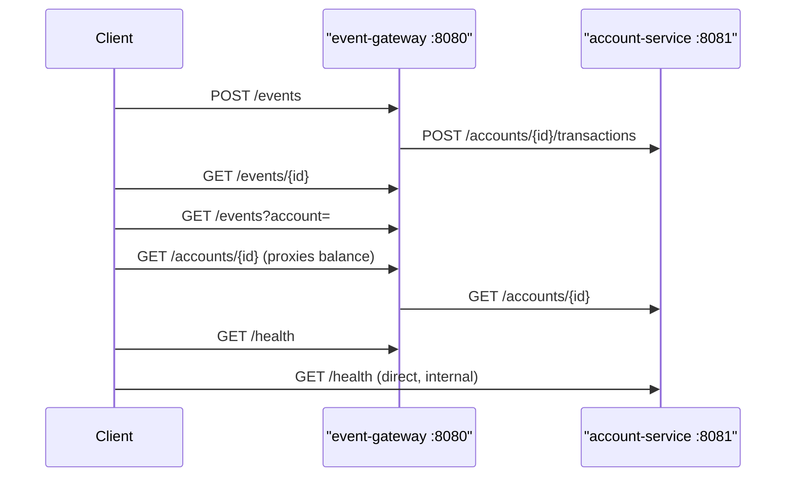
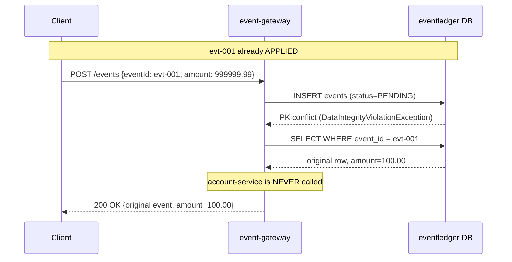
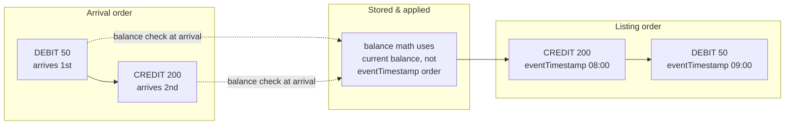
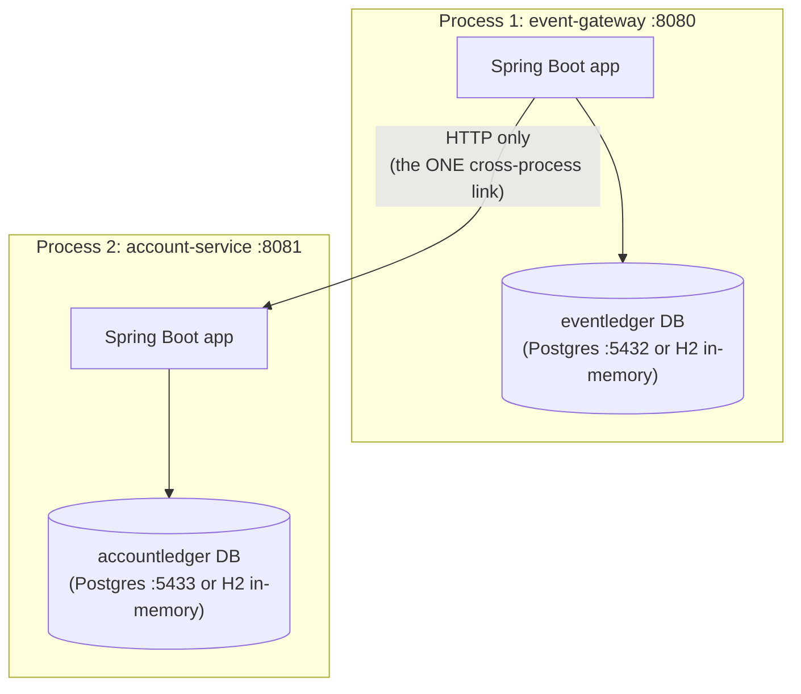
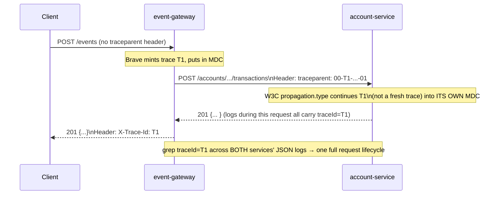
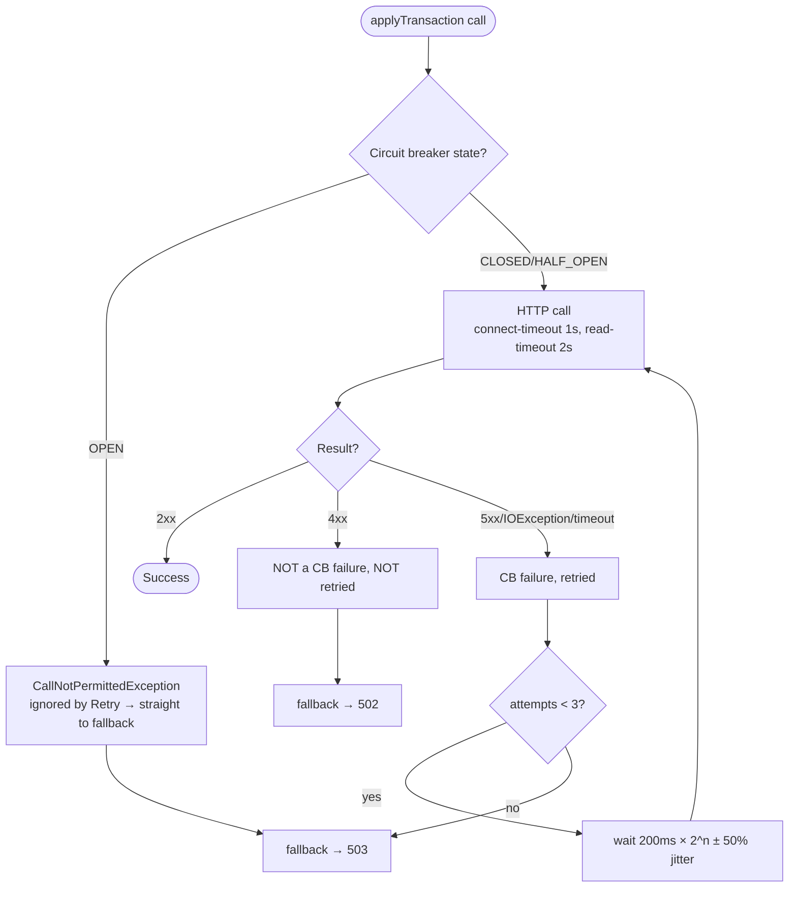
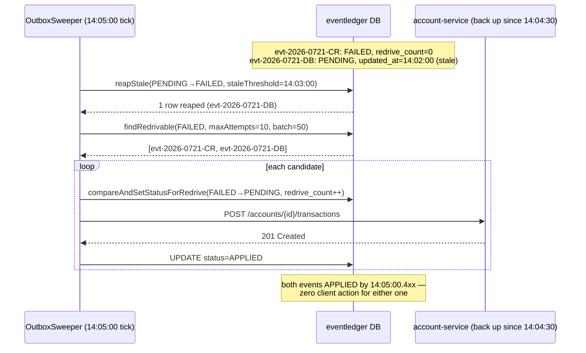
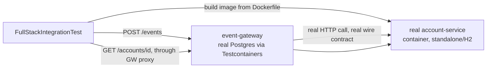

# Requirements Traceability — Event Ledger System

This document maps every requirement in the original spec to the **exact files** that implement
it, walks through **how** each implementation works step by step, gives a concrete **example**,
and adds a **diagram** wherever the flow isn't obvious from code alone. Each section ends with an
explicit **Status** line — `✅ Done` with the test class(es) that prove it, or `🚧 In progress` /
`❌ Not implemented` if a piece is missing. Nothing here is inferred from the spec text alone —
every code reference was read directly from the two repos as they exist today.

Repos: [`event-gateway`](.) (this repo) and `account-service` (sibling checkout at `../account-service`).

For architecture diagrams and a resiliency deep-dive beyond what's needed here, see
[WIKI.md](WIKI.md). For the full per-class test breakdown, see [TestCoverage.md](TestCoverage.md).
For load-bearing invariants and conventions, see [SKILL.md](SKILL.md).

## Table of contents

1. [System Overview](#1-system-overview)
2. [Core Functionality](#2-core-functionality)
   - [2.1 Idempotent eventId](#21-idempotent-eventid)
   - [2.2 Out-of-order event handling](#22-out-of-order-event-handling)
   - [2.3 Balance = sum(CREDIT) − sum(DEBIT)](#23-balance--sumcredit--sumdebit)
   - [2.4 Validation](#24-validation)
3. [Service Separation](#3-service-separation)
4. [Distributed Tracing](#4-distributed-tracing)
5. [Observability](#5-observability)
6. [Resiliency](#6-resiliency)
7. [Graceful Degradation](#7-graceful-degradation)
   - [7A. Beyond-Spec: Outbox Sweeper (Automatic Recovery)](#7a-beyond-spec-outbox-sweeper-automatic-recovery)
8. [Docker Compose](#8-docker-compose)
9. [Automated Tests](#9-automated-tests)
10. [README](#10-readme)
11. [Constraints](#11-constraints)
12. [Summary status table](#12-summary-status-table)

---

## 1. System Overview

**Requirement**: two independently-runnable microservices, each owning its own DB, communicating
over synchronous REST.

| Service | Port | Type | Endpoints required |
|---|---|---|---|
| **Event Gateway API** | `8080` | public | `POST /events`, `GET /events/{id}`, `GET /events?account=`, `GET /health` |
| **Account Service** | `8081` | internal | `POST /accounts/{id}/transactions`, `GET /accounts/{id}/balance`, `GET /accounts/{id}`, `GET /health` |

### Where this lives

- Gateway endpoints: [`EventController.java`](src/main/java/com/eventledger/gateway/api/EventController.java) (`/events*`), [`AccountController.java`](src/main/java/com/eventledger/gateway/api/AccountController.java) (`/accounts/{id}` balance proxy), [`HealthController.java`](src/main/java/com/eventledger/gateway/api/HealthController.java) (`/health`)
- Account Service endpoints: `account-service/src/main/java/com/eventledger/account/api/AccountController.java` (`/accounts/{id}/transactions`, `/accounts/{id}`, `/accounts/{id}/transactions` listing), `.../api/HealthController.java` (`/health`)

> **Note on `GET /accounts/{id}/balance`**: the spec names this path, but both services actually
> implement balance as `GET /accounts/{id}` returning the account (which includes `balance`) —
> see `AccountController.getAccount()` on account-service and `AccountController.getBalance()` on
> the gateway. This is a **naming simplification**, not a missing feature: there is exactly one
> way to read a balance, and it returns the balance. Functionally equivalent to the spec's intent.

### Step by step — how a request enters the system



1. A client submits an event to the Gateway (`POST /events`).
2. The Gateway validates and durably stores it, then calls Account Service synchronously to apply
   the balance change.
3. Reads (`GET /events/{id}`, `GET /events?account=`) are served entirely from the Gateway's own
   database — no downstream call.
4. Balance reads (`GET /accounts/{id}`) are proxied through the Gateway to Account Service, since
   the Gateway holds no balance itself.

**Status**: ✅ Done. Both services build and run as separate Spring Boot jars/processes/containers — see [`build.gradle`](build.gradle) (`bootJar`) and [§8 Docker Compose](#8-docker-compose).

---

## 2. Core Functionality

### 2.1 Idempotent eventId

**Requirement**: duplicate submit returns the original event, no double balance change.

**The core idea**: idempotency is enforced by a **database primary key**, not an application-level
`if (exists) return` check — because a check-then-insert has a race window between two concurrent
identical requests. The only thing that is atomic under concurrency is the database rejecting a
second `INSERT` with the same key.

#### Files involved

| File | Role |
|---|---|
| [`EventRecord.java`](src/main/java/com/eventledger/gateway/domain/EventRecord.java) | `eventId` is `@Id` — the primary key |
| [`db/migration/V1__create_events_table.sql`](src/main/resources/db/migration/V1__create_events_table.sql) | `event_id` declared `PRIMARY KEY` in schema |
| [`EventWriter.java`](src/main/java/com/eventledger/gateway/service/EventWriter.java) | Issues the insert; lets `DataIntegrityViolationException` escape |
| [`EventService.java`](src/main/java/com/eventledger/gateway/service/EventService.java) | Catches the PK violation, reads back and returns the **original** row |
| [`EventRepository.java`](src/main/java/com/eventledger/gateway/domain/EventRepository.java) | `compareAndSetStatus()` — atomic re-drive of a `FAILED` duplicate |
| `account-service/.../domain/Transaction.java` | Same pattern, mirrored — `event_id` is `Transaction`'s PK too |
| `account-service/.../service/AccountTransactionService.java` | `requireSameAccount()` guard + duplicate handling on the downstream hop |

#### Step by step

1. **Insert first, don't check first.** `EventService.submit()` calls `writer.insertPending(record)` immediately — no `existsById()` pre-check.
   ```java
   // EventService.submit()
   try {
       writer.insertPending(record);
   } catch (DataIntegrityViolationException duplicate) {
       return handleExisting(record.getEventId());
   }
   ```
2. **The DB is the referee.** `event_id` is the primary key (`EventRecord implements Persistable<String>`, forcing a bare `persist()` instead of JPA's default `merge()` which would do a silent SELECT-then-INSERT — see the class-level Javadoc in `EventRecord.java`). A concurrent duplicate insert throws `DataIntegrityViolationException`.
3. **On conflict, read back and return the ORIGINAL, not the resubmitted payload.**
   ```java
   private SubmitOutcome handleExisting(String eventId) {
       EventRecord existing = writer.find(eventId).orElseThrow(...);
       if (existing.getStatus() == EventStatus.FAILED) {
           if (writer.compareAndSetStatus(eventId, FAILED, PENDING) == 1) {
               applyDownstream(existing);   // one winner re-drives it
               return new SubmitOutcome(existing, true);
           }
       }
       return new SubmitOutcome(existing, true);  // APPLIED duplicate: just return it
   }
   ```
4. **HTTP status communicates the distinction.** `EventController.submit()` returns `201` for a new event, `200` for a duplicate — same body either way (the stored record).
5. **The same pattern repeats one hop downstream**, independently: `account-service`'s `Transaction.event_id` is also a primary key, and `AccountTransactionService.apply()` does an upfront duplicate read *and* catches a concurrent-insert race, both funneling through `requireSameAccount()` so a duplicate `eventId` reused for a *different* account is rejected with `409`, not silently merged.

#### Example

```
POST /events  {"eventId":"evt-001","accountId":"acct-977","type":"DEBIT","amount":100.00,...}
→ 201 Created  {"eventId":"evt-001","status":"APPLIED", ...}

POST /events  {"eventId":"evt-001","accountId":"acct-977","type":"DEBIT","amount":999999.99,...}  (tampered)
→ 200 OK  {"eventId":"evt-001","amount":100.00, "status":"APPLIED", ...}   ← original, amount unchanged
```

#### Diagram — duplicate resubmission



**Status**: ✅ Done — proven under real concurrency, not just sequentially. Tests: `EventIdempotencyTest` (gateway, 6 tests incl. an 8-thread concurrent race), `AccountControllerIT` + `AccountTransactionServiceTest` + `AccountTransactionServiceIT` (account-service, incl. the `eventId`-reused-for-different-account `409` case on both the upfront and race paths).

---

### 2.2 Out-of-order event handling

**Requirement**: listings sorted by `eventTimestamp`; balance always correct regardless of arrival order.

#### Files involved

| File | Role |
|---|---|
| [`EventRepository.java`](src/main/java/com/eventledger/gateway/domain/EventRepository.java) | `findByAccountIdOrderByEventTimestampAscEventIdAsc` |
| `account-service/.../domain/TransactionRepository.java` | Same ordering pattern for `GET /accounts/{id}/transactions` |
| [`db/migration/V1__create_events_table.sql`](src/main/resources/db/migration/V1__create_events_table.sql) | `idx_events_account_timestamp (account_id, event_timestamp, event_id)` |
| `account-service/.../service/AccountTransactionWriter.java` | Balance math applied **at arrival time**, independent of `eventTimestamp` |

#### Step by step

1. **Every list query orders by the upstream `eventTimestamp`, not by insertion/arrival order**, with `eventId` as a deterministic tiebreaker for identical timestamps — a derived Spring Data method name does the whole job: `findByAccountIdOrderByEventTimestampAscEventIdAsc`.
2. **Balance correctness is separate from listing order.** `AccountTransactionWriter.apply()` locks the account row (`findByIdForUpdate` — `SELECT ... FOR UPDATE`) and applies `newBalance = balance ± amount` against whatever the *current* balance is at the moment the call arrives — this is what makes concurrent/out-of-order arrivals converge to the same correct sum regardless of what order they show up in.
3. **A documented, deliberate limitation**: a DEBIT that arrives *before* its funding CREDIT (by wall-clock arrival, even if the CREDIT's `eventTimestamp` is earlier) is rejected for insufficient funds at the moment it arrives — `eventTimestamp` governs *display order*, never a replay/reprocessing order. This is pinned down by a test named for exactly this invariant (see below).

#### Example

Two events for `acct-977`, submitted **out of order** (DEBIT arrives first, its earlier-timestamped CREDIT second):

```
POST /events {"eventId":"evt-2","eventTimestamp":"2026-05-15T09:00:00Z","type":"DEBIT","amount":50}
POST /events {"eventId":"evt-1","eventTimestamp":"2026-05-15T08:00:00Z","type":"CREDIT","amount":200}

GET /events?account=acct-977
→ [ {eventId: evt-1, eventTimestamp: 08:00}, {eventId: evt-2, eventTimestamp: 09:00} ]   ← chronological, not arrival order
```

(Note: this particular DEBIT-then-CREDIT order would actually be *rejected* for insufficient funds at write time per the limitation above — the listing-order guarantee and the arrival-time balance check are two separate properties, both tested independently.)

#### Diagram



**Status**: ✅ Done. Tests: `EventOrderingTest` (gateway, 6 tests — chronological listing, per-account scoping, tie-break by `eventId`, unknown account → `[]`), `AccountTransactionWriterIT` (account-service — `debitArrivingBeforeItsFundingCreditIsRejectedEvenThoughChronologicallyItWouldHaveCleared` and mixed-sequence net-balance tests), `TransactionRepositoryIT` (ordering at the repository level).

---

### 2.3 Balance = sum(CREDIT) − sum(DEBIT)

#### Files involved

| File | Role |
|---|---|
| `account-service/.../domain/Account.java` | `balance` column, maintained incrementally |
| `account-service/.../service/AccountTransactionWriter.java` | The actual arithmetic |
| `account-service/.../domain/AccountRepository.java` | `findByIdForUpdate` — row lock for safe concurrent updates |

#### Step by step

1. `AccountTransactionWriter.apply()` locks the account row first: `accountRepository.findByIdForUpdate(accountId)` — a `SELECT ... FOR UPDATE`, serializing concurrent writers on the same account.
2. Computes the signed delta and applies it to the **current** balance:
   ```java
   BigDecimal delta = type == TransactionType.CREDIT ? amount : amount.negate();
   BigDecimal newBalance = account.getBalance().add(delta);
   if (newBalance.signum() < 0) {
       throw new InsufficientFundsException(accountId, account.getBalance(), amount);
   }
   account.setBalance(newBalance);
   ```
3. The balance is **maintained incrementally** in `accounts.balance` (not recomputed by summing `transactions` on every read) — but each `Transaction` row also snapshots `balance_after` at apply time, so the running total is independently auditable against the ledger.
4. Because step 1's row lock serializes all writers, `newBalance = balance ± amount` is safe under concurrency — proven by a 5-thread concurrent-apply test landing on the exact expected sum.

#### Example

```
Account acct-977 starts at 0.
CREDIT 200  → balance = 200
DEBIT   50  → balance = 150
CREDIT  25  → balance = 175
DEBIT  175  → balance = 0     (exact boundary — succeeds)
DEBIT    1  → 409 Conflict, insufficient funds; balance stays 0
```

**Status**: ✅ Done. Tests: `AccountTransactionWriterIT` (14 tests — CREDIT increases, DEBIT decreases, exact-zero boundary, mixed sequences, 5-thread concurrent-apply race with exact expected sum, insufficient funds leaves balance unchanged).

> Insufficient-funds rejection itself is called out in the code as a **documented assumption
> beyond the literal spec** (which only requires missing-field/`amount>0`/unknown-type
> validation) — see the `NICE TO HAVE` comment on `InsufficientFundsException` and the
> `signum() < 0` guard in `AccountTransactionWriter.apply()`. It's implemented, just flagged as
> an addition, not a gap.

---

### 2.4 Validation

**Requirement**: required fields, `amount > 0`, valid type, proper error codes.

#### Files involved

| File | Role |
|---|---|
| [`EventRequest.java`](src/main/java/com/eventledger/gateway/api/dto/EventRequest.java) | Bean Validation annotations on the inbound DTO |
| [`GlobalExceptionHandler.java`](src/main/java/com/eventledger/gateway/api/GlobalExceptionHandler.java) | Turns validation failures into structured `400` responses |
| `account-service/.../api/dto/TransactionRequest.java` | Mirrors the same constraints on the downstream hop |
| `account-service/.../api/GlobalExceptionHandler.java` | Same pattern, account-service side |

#### Step by step

1. **Every field is annotated with Jakarta Bean Validation constraints** directly on the request record:
   ```java
   public record EventRequest(
       @NotBlank @Size(max = 128) String eventId,
       @NotBlank @Size(max = 128) String accountId,
       @NotNull EventType type,                                    // CREDIT or DEBIT only — enum
       @NotNull @DecimalMin(value = "0.0", inclusive = false) BigDecimal amount,  // amount > 0
       @NotBlank @Pattern(regexp = "^[A-Za-z]{3}$") String currency,
       @NotNull Instant eventTimestamp,
       Map<String, Object> metadata) {}
   ```
2. `EventController.submit(@Valid @RequestBody EventRequest request)` — `@Valid` triggers validation before the method body ever runs.
3. **Two different failure shapes are both handled, not just one**: a *structurally valid* value that fails a constraint (e.g. `amount: -5`) throws `MethodArgumentNotValidException`; a value Jackson can't even *bind* (e.g. `"type": "WIRE"` — not a valid enum constant) throws `HttpMessageNotReadableException` *before* Bean Validation ever runs. `GlobalExceptionHandler` handles both, and for the enum case specifically unwraps the underlying `InvalidFormatException` to tell the client which values *are* legal:
   ```java
   @ExceptionHandler(HttpMessageNotReadableException.class)
   public ResponseEntity<ErrorResponse> handleUnreadable(HttpMessageNotReadableException e) {
       if (... ife.getTargetType().isEnum()) {
           String allowed = String.join(", ", enumConstants...);
           return build(BAD_REQUEST, "Invalid value for 'type'",
               List.of("type: 'WIRE' is not valid; allowed values are [CREDIT, DEBIT]"));
       }
       ...
   }
   ```
4. Every handler returns the same [`ErrorResponse`](src/main/java/com/eventledger/gateway/api/dto/ErrorResponse.java) shape: `timestamp, status, error, message, details[], traceId`.
5. The **same validation is duplicated on `account-service`'s `TransactionRequest`**, independently — necessary because the Gateway's own validation only guarantees *its* inbound contract, not what actually reaches Account Service over the wire.

#### Example

```
POST /events  {"eventId":"","accountId":"acct-1","type":"CREDIT","amount":-5,"currency":"US","eventTimestamp":"2026-05-15T08:00:00Z"}

→ 400 Bad Request
{
  "timestamp": "2026-07-21T10:00:00Z",
  "status": 400,
  "error": "Bad Request",
  "message": "Validation failed for the submitted event",
  "details": [
    "amount: amount must be greater than 0",
    "currency: currency must be a 3-letter code, e.g. USD",
    "eventId: eventId is required"
  ],
  "traceId": "a1b2c3d4e5f6..."
}
```

**Status**: ✅ Done. Tests: `EventValidationTest` (gateway, **29** parameterized tests — every field missing, blank-vs-missing, size boundary, malformed currency, non-numeric/zero/negative amount, unknown/lower-case type, null, malformed timestamp, non-JSON body, unsupported Content-Type `415`, unsupported method `405`, full `ErrorResponse` shape, and confirms a rejected event never reaches account-service), `AccountControllerIT` (account-service, 19 tests covering the same ground plus currency-mismatch `400` and insufficient-funds `409`), `GlobalExceptionHandlerTest` (account-service, 9 unit tests on every handler directly).

---

## 3. Service Separation

**Requirement**: separate processes, separate DBs, no shared state.

#### Files involved

| File | Role |
|---|---|
| [`build.gradle`](build.gradle) / `account-service/build.gradle` | Two independent Gradle modules — no shared parent, no shared jar |
| [`application.yml`](src/main/resources/application.yml) / `account-service/.../application.yml` | Separate `spring.datasource.url` per service (`eventledger` vs `accountledger`) |
| [`db/migration/V1__create_events_table.sql`](src/main/resources/db/migration/V1__create_events_table.sql) / `account-service/.../V1__create_accounts_and_transactions.sql` | Independent Flyway migration histories, independent schemas |
| [`Dockerfile`](Dockerfile) / `account-service/Dockerfile` | Independent build/runtime images |
| [`docker-compose.full.yml`](docker-compose.full.yml) | Two separate Postgres containers (`postgres` on `5432` for the gateway, `account-db` on `5433` for account-service) |

#### Step by step

1. Each service is its **own Gradle project** with its own `build.gradle`, own `bootJar` task, own `Dockerfile` — no shared library module, no shared JAR.
2. Each has a **dedicated Postgres database**: `eventledger` (gateway) and `accountledger` (account-service), on different ports in Docker Compose (`5432` / `5433`), with independently-versioned Flyway migrations under each service's own `db/migration/`.
3. **The only thing crossing the process boundary is the HTTP call** in `AccountServiceClient` — confirmed by there being zero references to the other service's DB host/port/credentials anywhere in either codebase.
4. Each can also run **fully standalone** with an embedded, in-memory H2 database (`application-standalone.yml` in each repo) — two independent processes, no Docker, no Postgres, nothing shared, not even a network requirement beyond the one HTTP call.

#### Diagram



**Status**: ✅ Done. Verified structurally (separate modules/DBs/schemas), and functionally by `FullStackIntegrationTest`, which runs both as genuinely separate built artifacts and drives a real request across the boundary.

---

## 4. Distributed Tracing

**Requirement**: trace ID generated at Gateway, propagated via HTTP header, logged in structured logs by both services.

#### Files involved

| File | Role |
|---|---|
| [`RestClientConfig.java`](src/main/java/com/eventledger/gateway/config/RestClientConfig.java) | Builds the outbound `RestClient` from the auto-configured, Micrometer-instrumented builder — this is what injects `traceparent` |
| [`application.yml`](src/main/resources/application.yml) `management.tracing.propagation.type: W3C` | Forces Brave (gateway's tracer) to use the W3C `traceparent` header format |
| `account-service/.../application.yml` `management.tracing.propagation.type: W3C` | Forces account-service's OTel/Micrometer bridge to *continue* an inbound `traceparent` instead of minting a fresh trace |
| [`TraceIdResponseFilter.java`](src/main/java/com/eventledger/gateway/config/TraceIdResponseFilter.java) / `account-service/.../config/TraceIdResponseFilter.java` | Echoes the current trace ID back as `X-Trace-Id` on every response |
| [`logback-spring.xml`](src/main/resources/logback-spring.xml) / `account-service/.../logback-spring.xml` | Puts `traceId`/`spanId` from the MDC into every JSON log line |
| [`GlobalExceptionHandler.java`](src/main/java/com/eventledger/gateway/api/GlobalExceptionHandler.java) | Includes `traceId` in every error body too |

#### Step by step

1. **Trace generation**: on an inbound request with no `traceparent` header, Spring Boot's Micrometer Tracing (Brave, on the gateway) mints a new trace and puts `traceId`/`spanId` into the SLF4J MDC automatically — no application code needed to *create* it.
2. **Propagation on the outbound call**: `RestClientConfig.accountServiceRestClient()` is built from the **auto-configured** `RestClient.Builder`, not a hand-rolled `RestClient.create()` — that auto-configured builder carries the Micrometer observation instrumentation that injects the W3C `traceparent` header onto the outbound HTTP call automatically. The code comment is explicit about why this matters:
   > "Hand-rolling `RestClient.create()` here would silently break trace propagation."
3. **Continuation on the receiving side**: account-service must be told to *speak* W3C, or its default tracer format won't recognize the incoming header and will start a fresh trace instead of continuing it — this is exactly what `management.tracing.propagation.type: W3C` fixes on both `application.yml` files. (This was an actual bug found and fixed — see commit `a93d250` and `TracePropagationTest` on account-service, which is literally the test that caught it.)
4. **Logging**: both `logback-spring.xml` files configure a `LogstashEncoder` JSON appender with `<includeMdcKeyName>traceId</includeMdcKeyName>` and `spanId` — since Micrometer Tracing already populated the MDC in step 1/3, every log line in both services during the same request carries the *same* `traceId`.
5. **Client-visible confirmation**: `TraceIdResponseFilter` (present in both services, `@Order(HIGHEST_PRECEDENCE + 10)`) copies the active span's trace ID onto the response as `X-Trace-Id` — so a caller (or a test) can take that header value and grep it across both services' logs directly.

#### Example

```
$ curl -i localhost:8080/events -d @evt.json -H "Content-Type: application/json"
HTTP/1.1 201 Created
X-Trace-Id: 6b8f2a1c9d3e4f5061728394a5b6c7d8
...

# event-gateway log line:
{"timestamp":"...","level":"INFO","service":"event-gateway","traceId":"6b8f2a1c9d3e4f5061728394a5b6c7d8", "message":"Accepted eventId=evt-001 ..."}

# account-service log line, SAME traceId, different process:
{"timestamp":"...","level":"INFO","service":"account-service","traceId":"6b8f2a1c9d3e4f5061728394a5b6c7d8","message":"Applied eventId=evt-001 ..."}
```

#### Diagram



**Status**: ✅ Done. Tests: `TracePropagationTest` on **both** repos — gateway (3 tests: header generated and forwarded, same trace ID in the gateway's own response/logs), account-service (4 tests: inbound `traceparent` is *continued* not replaced, in both the response header and the error body's `traceId`, and a request with no inbound header still mints its own trace), `TraceIdResponseFilterTest` (account-service, header set only when a span is active).

---

## 5. Observability

**Requirement**: JSON structured logs (trace ID, timestamp, level, service name), `/health` with DB connectivity check, ≥1 custom metric.

#### Files involved

| File | Role |
|---|---|
| [`logback-spring.xml`](src/main/resources/logback-spring.xml) / `account-service/.../logback-spring.xml` | JSON log format |
| [`HealthController.java`](src/main/java/com/eventledger/gateway/api/HealthController.java) / `account-service/.../HealthController.java` | `GET /health` with DB check |
| [`EventMetrics.java`](src/main/java/com/eventledger/gateway/service/EventMetrics.java) / `account-service/.../AccountMetrics.java` | Custom business metrics |
| [`application.yml`](src/main/resources/application.yml) `management.endpoints.web.exposure.include` | Exposes `/actuator/prometheus` for scraping |

#### Step by step — JSON logs

1. `logback-spring.xml` configures a `LogstashEncoder` appender named `JSON`, active on every profile except `local` (where plain text is used for IDE readability):
   ```xml
   <encoder class="net.logstash.logback.encoder.LogstashEncoder">
       <fieldNames>
           <timestamp>timestamp</timestamp>
           <level>level</level>
           <logger>logger</logger>
           <message>message</message>
       </fieldNames>
       <includeMdcKeyName>traceId</includeMdcKeyName>
       <includeMdcKeyName>spanId</includeMdcKeyName>
       <customFields>{"service":"${serviceName}"}</customFields>
   </encoder>
   ```
   This gets all four required fields — `timestamp`, `level`, `service` (`event-gateway` / `account-service`, injected via `springProperty`), and `traceId` — on every line, for free, from a config change rather than manual `log.info("... traceId={}", ...)` calls scattered through the code.

#### Step by step — `/health` with DB connectivity

2. `HealthController.health()` is a **plain controller**, not just Spring Boot Actuator's `/actuator/health` — the spec asks for `GET /health` specifically:
   ```java
   @GetMapping("/health")
   public ResponseEntity<Map<String, Object>> health() {
       boolean databaseUp = isDatabaseReachable();
       ...
       return ResponseEntity.status(databaseUp ? OK : SERVICE_UNAVAILABLE).body(body);
   }

   private boolean isDatabaseReachable() {
       try (Connection connection = dataSource.getConnection()) {
           return connection.isValid(2);   // actual DB round-trip, not just "did the pool start"
       } catch (SQLException e) {
           return false;
       }
   }
   ```
3. On the Gateway specifically, `/health` **also** reports the `accountService` circuit breaker's state (`OPEN`/`CLOSED`/`HALF_OPEN`, failure rate, buffered calls) — but deliberately does **not** let a downstream outage flip the Gateway's own `status` to `DOWN`. The doc comment explains why: an orchestrator's liveness probe killing the Gateway because *account-service* is unhealthy would be exactly the kind of cascading failure the circuit breaker exists to prevent.

#### Step by step — custom metrics

4. `EventMetrics` (gateway) and `AccountMetrics` (account-service) wrap a Micrometer `MeterRegistry` with **business-level counters**, deliberately not just another generic HTTP-request counter (Spring Boot already provides `http.server.requests` for free):
   ```java
   registry.counter("events.received", "type", type.name()).increment();
   registry.counter("events.duplicate", "existing_status", status).increment();
   registry.counter("events.applied", "type", type.name()).increment();
   registry.counter("events.rejected", "reason", reason).increment();
   registry.counter("events.downstream.failed", "reason", reason).increment();
   // + a Timer: events.apply.latency, tagged by outcome
   ```
   That's well over the "≥1" bar — 5 counters plus a latency timer, all scraped at `/actuator/prometheus` (exposed via `management.endpoints.web.exposure.include: health, info, metrics, prometheus, circuitbreakers, circuitbreakerevents`).

#### Example

```
$ curl -s localhost:8080/health | jq
{
  "service": "event-gateway",
  "status": "UP",
  "timestamp": "2026-07-21T10:00:00Z",
  "checks": {
    "database": "UP",
    "accountServiceCircuitBreaker": {"state": "CLOSED", "failureRate": -1.0, "bufferedCalls": 0}
  }
}

$ curl -s localhost:8080/actuator/prometheus | grep events_applied
events_applied_total{type="CREDIT",...} 12.0
events_applied_total{type="DEBIT",...} 7.0
```

**Status**: ✅ Done. Tests: `HealthAndMetricsTest` (gateway, 2 tests — `/health` reports dependencies, metrics endpoint exposes the custom counters), `HealthControllerIT` (account-service, `/health` reports `UP` with DB check passing), `AccountMetricsTest` (account-service, 3 tests on applied/duplicate/rejection counters).

---

## 6. Resiliency

**Requirement**: pick ≥1 of circuit breaker / bulkhead / timeout+retry with backoff.

**What was actually built: three of these, stacked** — circuit breaker **and** retry-with-backoff, **and** an explicit connect/read timeout underpinning both. See [WIKI.md §5](WIKI.md#5-resilience4j-deep-dive-retry--circuit-breaker) for the full deep-dive; this section covers what's needed to trace it to code.

#### Files involved

| File | Role |
|---|---|
| [`AccountServiceClient.java`](src/main/java/com/eventledger/gateway/client/AccountServiceClient.java) | `@Retry` + `@CircuitBreaker` annotations, fallback methods |
| [`RestClientConfig.java`](src/main/java/com/eventledger/gateway/config/RestClientConfig.java) | Connect/read timeout on the underlying HTTP client |
| [`application.yml`](src/main/resources/application.yml) `resilience4j.*` | All tuning: window size, thresholds, backoff, jitter |
| [`AccountServiceProperties.java`](src/main/java/com/eventledger/gateway/client/AccountServiceProperties.java) | Binds `account-service.connect-timeout` / `read-timeout` |

#### Step by step

1. **Timeout first — it's the foundation the other two depend on.** `RestClientConfig` sets an explicit connect timeout (1s) and read timeout (2s) on the `RestClient`'s request factory. Without this, a *slow* (not dead) downstream would just park every Gateway request thread on an open socket forever — the circuit breaker never sees a failure to count, because no call ever actually returns.
2. **Retry wraps Circuit Breaker** — Resilience4j's documented default aspect order:
   ```java
   @Retry(name = "accountService", fallbackMethod = "applyTransactionFallback")
   @CircuitBreaker(name = "accountService")
   public void applyTransaction(String accountId, TransactionRequest request) { ... }
   ```
   composing as `Retry( CircuitBreaker( call ) )` — Retry is outermost.
3. **Circuit breaker config** (`application.yml`): count-based sliding window of 10 calls, opens at ≥50% failure rate once ≥5 calls have happened, stays `OPEN` for 10s, then allows 2 trial calls in `HALF_OPEN` before deciding to close or reopen.
4. **Retry config**: 3 attempts, 200ms base delay, ×2 exponential backoff, ±50% randomized jitter (so many concurrent callers retrying the same blip don't re-stampede the recovering service in lockstep).
5. **4xx responses are explicitly excluded from both** — `ignore-exceptions: HttpClientErrorException` on both the breaker and retry config. A 4xx means "the downstream is healthy and correctly rejected us," not an outage; retrying it 3 times would just get the same rejection 3 times, and counting it toward the breaker would let one bad client payload deny service to every *other* caller.
6. **The breaker being `OPEN` must not still burn 3 retry attempts** — `CallNotPermittedException` is on Retry's own `ignore-exceptions` list, so an open breaker fails fast with zero network calls, not fast-after-3-tries.
7. **Fallback methods draw the final status-code line**: a 4xx → `AccountServiceRejectedException` → `502`; anything else (5xx, IOException, timeout, open breaker) → `AccountServiceUnavailableException` → `503`.

#### Diagram — one call's decision tree



#### Example

```
# account-service returns 500 three times in a row for the same request:
POST /events {"eventId":"evt-x", ...}
  → attempt 1: 500 → wait ~100-300ms
  → attempt 2: 500 → wait ~200-600ms
  → attempt 3: 500 → retries exhausted
→ 503 Service Unavailable  {"message": "Account Service is unavailable. The event has been
  stored and can be safely resubmitted with the same eventId once the service recovers."}

# after enough failed calls fill the 10-call window at ≥50% failure rate:
POST /events {"eventId":"evt-y", ...}
→ 503 immediately — CircuitBreaker.State == OPEN, zero HTTP calls made downstream
```

**Status**: ✅ Done — exceeds the "≥1" bar (3 patterns, correctly composed). Tests: `ResiliencyTest` (13 tests, asserting on **actual `CircuitBreakerRegistry` state**, not just HTTP codes — breaker opens after repeated failures then fails fast with zero additional downstream traffic, a slow downstream is timed out not hung, retry actually re-attempts, a 4xx neither retries nor trips the breaker).

---

## 7. Graceful Degradation

**Requirement**: when Account Service is down — `POST /events` → `503` not hang/500; `GET /events/*` still works; balance queries → clear unreachable error.

#### Files involved

| File | Role |
|---|---|
| [`EventService.java`](src/main/java/com/eventledger/gateway/service/EventService.java) | Write path: store-then-call ordering, `FAILED` status on downstream failure |
| [`AccountController.java`](src/main/java/com/eventledger/gateway/api/AccountController.java) (gateway) | Balance proxy — reuses the same resiliency stack |
| [`GlobalExceptionHandler.java`](src/main/java/com/eventledger/gateway/api/GlobalExceptionHandler.java) | Maps failure types to the right status code, never a raw `500` for a downstream problem |
| [`EventWriter.java`](src/main/java/com/eventledger/gateway/service/EventWriter.java) | Reads (`find`, `findByAccount`) never touch `AccountServiceClient` |

#### Step by step

1. **`POST /events` → `503`, never a hang, never `500`.** The write sequence in `EventService.submit()` is: (a) durably `INSERT ... status=PENDING` *first*, (b) call downstream, (c) update status based on the outcome. Because the read timeout (§6) bounds step (b), the request thread can never park indefinitely. If the downstream call ultimately fails — whether by timeout, 5xx, connection refusal, or an already-open breaker — `applyDownstream()` catches `AccountServiceException`, marks the row `FAILED`, and re-throws; `GlobalExceptionHandler.handleUnavailable()` turns that into a `503` with an actionable message, not a stack-trace `500`.
2. **The event is never lost.** Because it was written to `eventledger` *before* the downstream call was even attempted, a client that gets the `503` can safely resubmit the same `eventId` later — `EventService.handleExisting()` sees the `FAILED` status and re-drives it via `compareAndSetStatus(FAILED → PENDING)`.
3. **`GET /events/{id}` and `GET /events?account=` keep working**, unconditionally — this isn't a fallback or a special case, it's a structural property of the code: `EventService.get()` and `.listByAccount()` call only `EventWriter` (local DB access), and never reference `AccountServiceClient` anywhere in their method bodies. There is no downstream call in that code path to fail in the first place.
4. **Balance queries give a clear, distinguishable error** — three different outcomes, not one generic failure:
   - Account Service reachable, account exists → `200` with the real balance.
   - Account Service reachable, account genuinely doesn't exist → `404` (accurately proxied, **not laundered into a 503** — the fallback in `AccountServiceClient.getBalanceFallback()` specifically detects `HttpClientErrorException.NotFound` and rethrows as `AccountNotFoundException`, so "no" and "unreachable" are never confused).
   - Account Service unreachable / breaker open / timeout → `503` with a message that explicitly says the balance "cannot be retrieved right now."

#### Diagram



```mermaid
sequenceDiagram
    participant C as Client
    participant GW as event-gateway
    participant GWDB as eventledger DB
    participant AS as account-service

    Note over AS: Account Service is DOWN
    rect rgb(60,20,20)
    C->>GW: POST /events {eventId: evt-x}
    GW->>GWDB: INSERT status=PENDING
    GW->>AS: (retry+breaker exhausted)
    GW->>GWDB: UPDATE status=FAILED
    GW-->>C: 503 "stored, safe to resubmit"
    end
    rect rgb(20,40,60)
    C->>GW: GET /events/evt-x
    GW->>GWDB: SELECT (no call to AS)
    GW-->>C: 200 {status: FAILED}
    end
    rect rgb(20,40,60)
    C->>GW: GET /events?account=acct-1
    GW->>GWDB: SELECT ... ORDER BY event_timestamp
    GW-->>C: 200 [...]
    end
    rect rgb(60,20,20)
    C->>GW: GET /accounts/acct-1
    GW->>AS: GET /accounts/acct-1 (fails)
    GW-->>C: 503 "Account Service is unreachable. Balance cannot be retrieved right now."
    end
```

**Status**: ✅ Done. Tests: `ResiliencyTest` covers all four sub-requirements directly — downstream failure → `503` (`downstreamFailureIsA503`), event durably stored (`eventSurvivesDownstreamFailure`), reads keep working during an outage, and the three-way balance-query outcome split (`200`/`404`/`503`, with `404` proven **not** to be laundered into `503`). Gateway's own `/health` also stays `UP` when only the downstream is down (see §5).

---

## 7A. Beyond-Spec: Outbox Sweeper (Automatic Recovery)

**Not required by the spec.** §7 above closes the *synchronous* half of graceful degradation — a
failed write returns `503`, never a hang. But until this was added, the only way a `FAILED` event
ever actually got applied was a **client** resubmitting the same `eventId`. `OutboxSweeper` closes
that remaining gap: a configurable `@Scheduled` job that redrives `FAILED` events — and reaps
`PENDING` rows orphaned by a crash mid-call — on its own, with no client action required. This
section exists to show the mechanism with real data, the way every other section above does.

#### Files involved

| File | Role |
|---|---|
| [`OutboxSweeper.java`](src/main/java/com/eventledger/gateway/service/OutboxSweeper.java) | The `@Scheduled` job — reap phase, then redrive phase |
| [`OutboxSweeperProperties.java`](src/main/java/com/eventledger/gateway/service/OutboxSweeperProperties.java) | `enabled`, `staleAfter`, `batchSize`, `maxRedriveAttempts` |
| [`EventService.java`](src/main/java/com/eventledger/gateway/service/EventService.java) | `redriveIfEligible()` — shared by the sweeper and a client resubmit |
| [`EventRepository.java`](src/main/java/com/eventledger/gateway/domain/EventRepository.java) | `reapStale`, `findRedrivable`, `compareAndSetStatusForRedrive` |
| [`V2__add_redrive_count.sql`](src/main/resources/db/migration/V2__add_redrive_count.sql) | The `redrive_count` column backing the poison-pill cap |

#### Worked example, with real data — three events, three outcomes

Setup: `account-service` goes down for a deploy at **14:00:00**, comes back up at **14:04:30**.
The sweeper runs every 5 minutes (`interval-ms` default), so ticks land at `14:00:00`, `14:05:00`,
`14:10:00`, ... `stale-after` is 2 minutes, `max-redrive-attempts` is 10.

**Event 1 — `evt-2026-0721-CR`** (`acct-5521`, `CREDIT`, `250.00 USD`), submitted normally at `14:00:00`:

| Time | What happens |
|---|---|
| `14:00:00.000` | `POST /events`. Gateway inserts `status=PENDING`, calls `account-service` — it's mid-deploy, the call fails after retry exhaustion. Row flips to `FAILED`, `redrive_count=0`. Client gets `503`. |
| `14:00:00.9xx` | Client does **not** resubmit (e.g. a fire-and-forget batch job, no retry logic of its own). |
| `14:05:00.000` | Sweep tick. **Reap phase**: no orphaned `PENDING` rows (this one already settled to `FAILED` cleanly). **Redrive phase**: `findRedrivable(FAILED, maxAttempts=10, batchSize=50)` returns this row (`redrive_count=0 < 10`). `redriveIfEligible()`: CAS `FAILED→PENDING` succeeds, `redrive_count` becomes `1`. `account-service` has been back up for 30 seconds now → call succeeds → CAS `PENDING→APPLIED`. |
| `14:05:00.3xx` | `evt-2026-0721-CR` is `APPLIED`, `redrive_count=1`. **No client action ever happened** — `GET /events/evt-2026-0721-CR` now shows it settled, five minutes after the original failure, entirely automatically. |

**Event 2 — `evt-2026-0721-DB`** (`acct-5521`, `DEBIT`, `40.00 USD`), Gateway pod is killed mid-call:

| Time | What happens |
|---|---|
| `14:02:00.000` | `POST /events`. Gateway inserts `status=PENDING` — then the process is killed (e.g. by an orchestrator) before the downstream call is even attempted. Row is permanently stuck at `PENDING`, `updated_at=14:02:00`. No client response was ever sent, so there's nothing for a client to resubmit against — this row is invisible to the client-resubmit recovery path entirely. |
| `14:05:00.000` | Sweep tick. **Reap phase**: `reapStale(PENDING, FAILED, staleThreshold=14:03:00, ...)` — `14:02:00 < 14:03:00`, so this row matches and is bulk-flipped to `FAILED`. **Redrive phase**, same tick: the just-reaped row is now `FAILED` with `redrive_count=0`, so it's picked up in the *same* sweep's `findRedrivable` query and redriven immediately. |
| `14:05:00.4xx` | `evt-2026-0721-DB` is `APPLIED` — recovered from a crash that left **no trace for any client to act on**, purely by the sweeper's reap+redrive combination. |

**Event 3 — `evt-2026-0721-BAD`** (`acct-9901`, `DEBIT`, `999999.00 USD`) — insufficient funds, a genuine poison pill:

| Time / tick | `redrive_count` after | What happens |
|---|---|---|
| `14:00:00` (original submit) | `0` | Fails validation-adjacent (insufficient funds is a `409`, not a transient outage — in this illustration assume it's misclassified as `FAILED` rather than immediately surfaced, to show the cap working) |
| `14:05:00` sweep | `1` | Redrive attempted, fails again, still `FAILED` |
| `14:10:00`, `14:15:00`, ... `14:45:00` (8 more ticks) | `2` → ... → `9` | Same — each tick attempts, fails, increments |
| `14:50:00` sweep | `10` | The 10th attempt — still fails |
| `14:55:00` sweep | **`10` (unchanged)** | `findRedrivable` query is `WHERE redrive_count < 10` — `10 < 10` is `false`, so this row is **excluded** from the candidate list. No 11th attempt is made, no more log noise every 5 minutes. |
| any time after | manual resubmit only | A human (or the original client) can still `POST /events` with `eventId=evt-2026-0721-BAD` directly — `EventService.handleExisting()` doesn't check the cap, only the sweeper's own query does — so a deliberate manual retry always still works even after the sweeper has given up. |

#### Diagram — Event 1 and Event 2 in the same sweep tick



**Status**: ✅ Done (beyond spec). Tests: `OutboxSweeperTest` (`redrivesFailedEvent` and
`reapsStalePendingAndRedrives` are exactly Event 1 and Event 2 above; `stopsRetryingPastMaxAttempts`
is Event 3), `OutboxSweeperSchedulingTest` (proves the 5-minute tick cadence itself is real and
configurable). See [WIKI.md §6](WIKI.md#6-async-recovery-outbox-sweeper-built-and-a-possible-kafka-future-not-built)
for the full design rationale.

---

## 8. Docker Compose

**Requirement**: `docker-compose.yml` to start both services (or manual instructions).

#### Files involved

| File | Role |
|---|---|
| [`docker-compose.full.yml`](docker-compose.full.yml) | **Single-command** stack: builds both services + both Postgres DBs in one project |
| [`docker-compose.yml`](docker-compose.yml) | Gateway-only stack, joins an external network so it can be paired with account-service's own independent stack |
| [`Dockerfile`](Dockerfile) | Multi-stage build: `gradle:8.10.2-jdk21-alpine` → `eclipse-temurin:21-jre-alpine`, non-root user |
| `account-service/docker-compose.yml`, `account-service/Dockerfile` | Account-service's own independent stack/image |

#### Step by step

1. **Recommended path — one command**: `docker-compose.full.yml` defines 4 services — `postgres` (gateway's DB, `:5432`), `account-db` (account-service's DB, `:5433`), `account-service` (built from `../account-service`'s own Dockerfile), and `gateway` (built from this repo's `Dockerfile`). `depends_on` with `condition: service_healthy` ensures the gateway doesn't start accepting traffic before its own DB *and* account-service are both confirmed healthy.
2. **Health-gated startup, not just "container running"**: every service has a Docker-level `healthcheck` (`pg_isready` for Postgres, `wget` against `/health` for the two app containers) — `depends_on: condition: service_healthy` won't start a dependent container until the healthcheck passes, not merely until the process launches.
3. **Alternative path — two independent stacks**: `docker-compose.yml` (gateway alone) joins an externally-created Docker network (`event-ledger-net`) that account-service's own `docker-compose.yml` also joins — this lets either service be started, stopped, or rebuilt without touching the other, at the cost of one extra manual step (`docker network create`).
4. **The image itself** is a multi-stage build — compiled inside a `gradle` image, then copied into a minimal `eclipse-temurin:21-jre-alpine` runtime image running as a non-root `app` user.

#### Example

```bash
# single command, from event-gateway/ (requires ../account-service checked out)
docker compose -f docker-compose.full.yml up --build

# check both are healthy
curl -s localhost:8080/health
curl -s localhost:8081/health
```

**Status**: ✅ Done. Both the single-command and the two-independent-stacks paths exist and are documented in [README.md](README.md#starting-the-system). `FullStackIntegrationTest` builds and runs the real `account-service` Docker image as part of the automated suite, so the Dockerfile itself is exercised by CI, not just by manual testing.

---

## 9. Automated Tests

**Requirement**: core functionality, resiliency, trace propagation, ≥1 full integration test, runnable via a standard command.

#### Files involved

Full per-class breakdown lives in [TestCoverage.md](TestCoverage.md) — summarized here with direct links.

| Requirement area | Test class(es) | Count |
|---|---|---|
| Idempotency | [`EventIdempotencyTest`](src/test/java/com/eventledger/gateway/EventIdempotencyTest.java) | 6 |
| Out-of-order / balance | [`EventOrderingTest`](src/test/java/com/eventledger/gateway/EventOrderingTest.java) | 6 |
| Validation | [`EventValidationTest`](src/test/java/com/eventledger/gateway/EventValidationTest.java) | 29 |
| Resiliency / graceful degradation | [`ResiliencyTest`](src/test/java/com/eventledger/gateway/ResiliencyTest.java) | 13 |
| Trace propagation | [`TracePropagationTest`](src/test/java/com/eventledger/gateway/TracePropagationTest.java) (+ account-service's own) | 3 + 4 |
| Health / metrics | [`HealthAndMetricsTest`](src/test/java/com/eventledger/gateway/HealthAndMetricsTest.java) | 2 |
| **Full integration (Gateway → real Account Service)** | [`FullStackIntegrationTest`](src/test/java/com/eventledger/gateway/FullStackIntegrationTest.java) | 1 |
| Beyond-spec: outbox sweeper redrive/reap/poison-pill logic | [`OutboxSweeperTest`](src/test/java/com/eventledger/gateway/OutboxSweeperTest.java) | 6 |
| Beyond-spec: outbox sweeper interval is configurable, real `@Scheduled` trigger | [`OutboxSweeperSchedulingTest`](src/test/java/com/eventledger/gateway/OutboxSweeperSchedulingTest.java) | 1 |

Account-service adds its own **83** tests underneath (balance math, currency mismatch, account-service-side idempotency, its own trace continuation, domain entities, mappers, metrics) — **150 tests total across both repos, 0 failures**.

#### Step by step — how to run

```bash
# from either repo root
./gradlew test

# just one class while iterating
./gradlew test --tests "com.eventledger.gateway.ResiliencyTest"

# the one slow test — builds a real Docker image from ../account-service
./gradlew test --tests "com.eventledger.gateway.FullStackIntegrationTest"
```

Docker must be running (both suites use Testcontainers for a real Postgres, never H2, because the
idempotency guarantee depends on real unique-constraint behavior). [`AbstractIntegrationTest.java`](src/test/java/com/eventledger/gateway/AbstractIntegrationTest.java) wires up Testcontainers Postgres + a WireMock stub standing in for account-service; `FullStackIntegrationTest` is the one class that opts out of that shared harness (a `full-stack-test=true` marker forces its own, never-shared Spring context) and instead builds and runs the *real* account-service image.

#### The ≥1 full integration test, specifically

`FullStackIntegrationTest` builds `account-service`'s real Docker image from `../account-service/Dockerfile`, runs it with its `standalone` profile (embedded H2, so no second Postgres container is needed), and drives a real `POST /events` through the Gateway into it, then confirms the balance actually landed via `GET /accounts/{id}` through the Gateway's own proxy — proving the two *real* codebases agree on the wire contract, not just a WireMock stub that would happily return whatever a test tells it to.



**Status**: ✅ Done. `./gradlew test` (or the equivalent in account-service) is the single standard command; 150/150 tests pass on a clean run.

---

## 10. README

**Requirement**: architecture overview, setup, run instructions, test instructions, resiliency pattern rationale.

#### Files involved

| File | Section |
|---|---|
| [README.md](README.md) | Everything below |

| Required content | Where in README.md |
|---|---|
| Architecture overview | ["Architecture"](README.md#architecture) |
| Setup / run instructions | ["Starting the system"](README.md#starting-the-system) (both Compose variants), ["Running standalone, without Docker"](README.md#running-standalone-without-docker) |
| Test instructions | ["Running the tests"](README.md#running-the-tests) |
| Resiliency pattern rationale | ["Resiliency pattern"](README.md#resiliency-pattern) — explains *why* retry+breaker over a message queue, in detail |

Additional docs beyond the minimum bar: [WIKI.md](WIKI.md) (deep architecture diagrams, DB schemas, per-flow sequence diagrams, a full Resilience4j behavior deep-dive, and a designed-but-not-built async/Kafka enhancement), [TestCoverage.md](TestCoverage.md) (per-class test breakdown), [SKILL.md](SKILL.md) (quick-reference invariants for anyone extending the code).

**Status**: ✅ Done — and exceeded (3 supplementary docs beyond the required README).

---

## 11. Constraints

| Constraint | How it's satisfied |
|---|---|
| Language: Java / Python / C# | Java 21, Spring Boot 3 — see [`build.gradle`](build.gradle) |
| Commit history shows iterative work, no squashing | `git log --oneline` on **this repo**: 16 commits, e.g. `7835429` (module deps) → `f88d345` (schema) → `0b5a464` (domain model) → `32a07a9` (client+resiliency) → `695bcbb` (write path) → `b2ca7ba` (REST API+errors) → `80f38a7` (structured logging) → `ef2e881` (tests) → `365eed5` (docker) → ... → `a93d250` (bugfix: trace propagation + account-mismatch guard) → `47cd49d` (docs). `account-service` has its own 3-commit history (`5fc9009` → `03c8f33` → `9f3a518`). Neither history is a single squashed commit. |

**Status**: ✅ Done.

---

## 12. Summary status table

| # | Requirement | Status | Primary file(s) | Primary test(s) |
|---|---|---|---|---|
| 1 | System overview / API surface | ✅ Done | `EventController`, `AccountController` (both repos), `HealthController` (both) | all integration tests |
| 2.1 | Idempotent `eventId` | ✅ Done | `EventWriter`, `EventService`, `AccountTransactionService` | `EventIdempotencyTest`, `AccountControllerIT` |
| 2.2 | Out-of-order handling | ✅ Done | `EventRepository`, `AccountTransactionWriter` | `EventOrderingTest`, `AccountTransactionWriterIT` |
| 2.3 | Balance = CREDIT − DEBIT | ✅ Done | `AccountTransactionWriter.apply()` | `AccountTransactionWriterIT` |
| 2.4 | Validation | ✅ Done | `EventRequest`, `TransactionRequest`, both `GlobalExceptionHandler`s | `EventValidationTest`, `AccountControllerIT` |
| 3 | Service separation | ✅ Done | separate `build.gradle`/DBs/schemas | `FullStackIntegrationTest` |
| 4 | Distributed tracing | ✅ Done | `RestClientConfig`, `TraceIdResponseFilter` (both), `application.yml` W3C config | `TracePropagationTest` (both repos) |
| 5 | Observability | ✅ Done | `logback-spring.xml` (both), `HealthController` (both), `EventMetrics`/`AccountMetrics` | `HealthAndMetricsTest`, `HealthControllerIT`, `AccountMetricsTest` |
| 6 | Resiliency (≥1 pattern) | ✅ Done — 3 patterns | `AccountServiceClient`, `RestClientConfig`, `application.yml` resilience4j config | `ResiliencyTest` |
| 7 | Graceful degradation | ✅ Done | `EventService`, gateway `AccountController`, `GlobalExceptionHandler` | `ResiliencyTest` |
| 8 | Docker Compose | ✅ Done | `docker-compose.full.yml`, `docker-compose.yml`, `Dockerfile` | `FullStackIntegrationTest` (exercises the Dockerfile) |
| 9 | Automated tests | ✅ Done | — | 150 tests, 0 failures, both repos |
| 10 | README | ✅ Done | `README.md` | — |
| 11 | Constraints (language, commit history) | ✅ Done | `build.gradle`, git history | — |

**Nothing in the stated spec is outstanding.** Beyond the spec, an automatic background redrive for
events left in `FAILED` after an outage — previously recoverable only via client resubmit — has
since been built: `OutboxSweeper`, a configurable `@Scheduled` job that reuses
`EventService`/`EventWriter`/`AccountServiceClient` unchanged. See
[§7A](#7a-beyond-spec-outbox-sweeper-automatic-recovery) above for the worked example with real
data, and [WIKI.md §6](WIKI.md#6-async-recovery-outbox-sweeper-built-and-a-possible-kafka-future-not-built)
for the full design rationale — it was never required by the spec, so its absence was never a gap,
but it's flagged here since it's no longer accurate to call it "not built."
