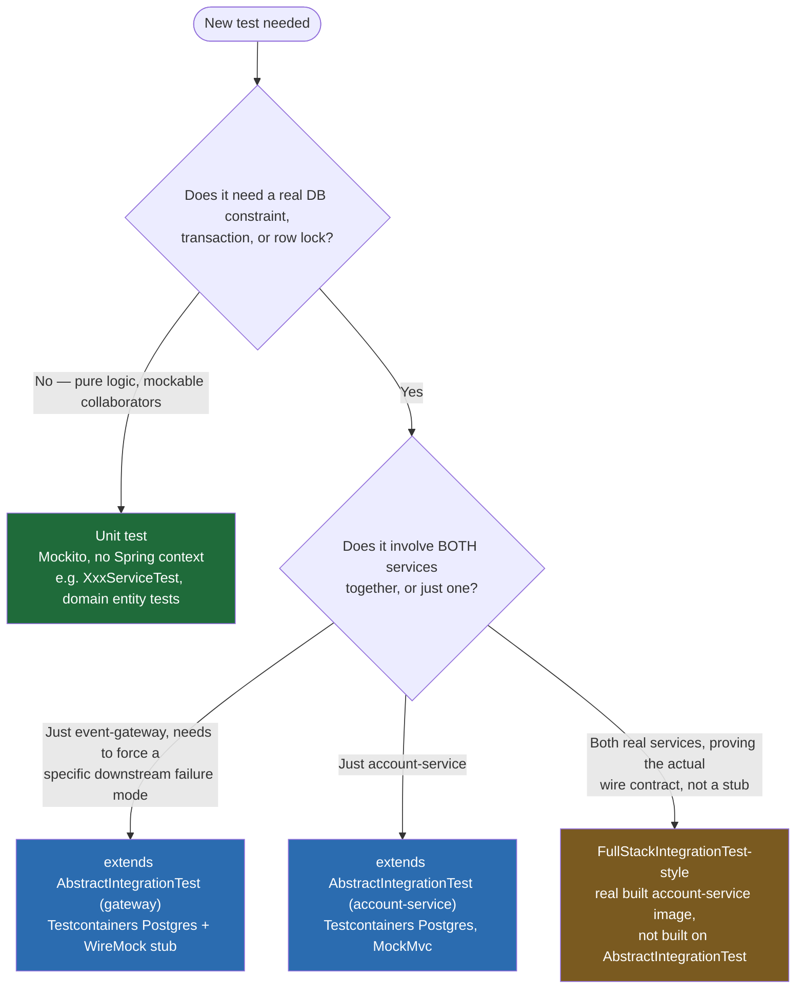

# SKILL.md — Event Ledger: Code Context & Test-Writing Guide

Read this before (a) writing a new test in either repo, or (b) answering any prompt about this
codebase. It's the condensed, load-bearing facts — architecture, conventions, gotchas — that
`WIKI.md` (diagrams) and `TestCoverage.md` (per-class breakdown) explain at length. This file is
the quick-reference; those two are the deep-dive.

## Table of contents

1. [System context](#1-system-context)
2. [Where things live](#2-where-things-live)
3. [Invariants that matter — don't break these silently](#3-invariants-that-matter--dont-break-these-silently)
4. [Config values worth knowing cold](#4-config-values-worth-knowing-cold)
5. [How to write a new test — decision tree](#5-how-to-write-a-new-test--decision-tree)
6. [Test-writing recipes](#6-test-writing-recipes)
7. [Checklist before calling a test done](#7-checklist-before-calling-a-test-done)
8. [Known gaps — don't rediscover these as if new](#8-known-gaps--dont-rediscover-these-as-if-new)

---

## 1. System context

Two independent Spring Boot 3 / Java 21 services, each with its own Postgres, talking over plain
HTTP — no shared DB, no shared in-process state, no message broker (yet — see `WIKI.md` §6).

- **`event-gateway`** (`:8080`) — public entry point. Validates and durably stores every event
  *before* calling downstream, keyed by client-supplied `eventId`. Owns `eventledger` DB, one
  table: `events`.
- **`account-service`** (`:8081`) — owns balances and the transaction ledger, the source of truth
  for "did this money move." Owns `accountledger` DB, two tables: `accounts`, `transactions`.
- The only thing crossing the process boundary: `event-gateway`'s `AccountServiceClient` calling
  `account-service`'s `AccountController` over HTTP, wrapped in Resilience4j retry + circuit
  breaker, with a W3C `traceparent` header tying both sides' logs to one trace.

Full diagrams: `WIKI.md` §1 (architecture), §2 (schemas), §5 (resiliency deep-dive).

## 2. Where things live

```
event-gateway/src/main/java/com/eventledger/gateway/
  api/            EventController, AccountController (balance proxy), GlobalExceptionHandler, HealthController
  api/dto/        EventRequest, EventResponse, ErrorResponse
  client/         AccountServiceClient (the ONLY outbound call), AccountBalance, TransactionRequest,
                  AccountServiceException hierarchy (Unavailable/Rejected), AccountNotFoundException
  config/         RestClientConfig (timeouts, trace propagation), TraceIdResponseFilter
  domain/         EventRecord (JPA entity, PK = eventId), EventStatus, EventType
  service/        EventService (orchestration), EventWriter (persistence + CAS), EventMapper, EventMetrics

account-service/src/main/java/com/eventledger/account/
  api/            AccountController (springdoc-annotated — this IS the OpenAPI contract), GlobalExceptionHandler
  api/dto/        TransactionRequest, TransactionResponse, AccountResponse, ErrorResponse
  config/         TraceIdResponseFilter
  domain/         Account, Transaction (JPA entities), TransactionType
  service/        AccountTransactionService (orchestration), AccountTransactionWriter (persistence,
                  balance math, row locking), AccountMapper, AccountMetrics,
                  exceptions: AccountNotFoundException, InsufficientFundsException,
                  CurrencyMismatchException, EventIdAccountMismatchException
```

Test packages mirror main packages 1:1 in both repos.

## 3. Invariants that matter — don't break these silently

These are the properties the whole design leans on. If a change touches any of these files,
re-read the relevant test class before assuming it still holds.

- **Idempotency is a database constraint, not an app-level check.** `events.event_id` and
  `transactions.event_id` are primary keys. Both `EventWriter`/`EventService` and
  `AccountTransactionWriter`/`AccountTransactionService` use insert-and-catch-`DataIntegrityViolationException`,
  never check-then-insert (that has a race window). Both `EventRecord` and `Transaction` implement
  `Persistable<String>` so Spring Data issues a bare `persist()`, not `merge()` (SELECT-then-INSERT).
- **`eventId` is a global key, not scoped per account.** A duplicate `eventId` for a *different*
  account is a real, distinct failure mode (`EventIdAccountMismatchException` → `409` on
  account-service's side) — not automatically "just a duplicate." `AccountTransactionService.requireSameAccount()`
  is the guard; it must run on **both** the upfront-duplicate path and the concurrent-race
  readback path (see `AccountTransactionServiceTest`'s two mismatch tests).
- **Balance is checked at arrival time, not by `eventTimestamp` order.** A DEBIT can be rejected
  even if a CREDIT that would have covered it exists but simply hasn't arrived yet.
  `eventTimestamp` governs display/listing order only, never a replay/processing order. See
  `AccountTransactionWriterIT.debitArrivingBeforeItsFundingCreditIsRejectedEvenThoughChronologicallyItWouldHaveCleared`
  — the name is the invariant.
- **A 4xx from the downstream must never trip the circuit breaker or get retried.** It means "the
  downstream is healthy and correctly rejected us," not an outage — counting it would let one bad
  payload deny service to every other caller. Config: `circuitbreaker.ignore-exceptions` and
  `retry.ignore-exceptions`/`retry-exceptions` in `application.yml` both exclude
  `HttpClientErrorException`.
- **`CallNotPermittedException` (breaker OPEN) must be ignored by Retry.** Retry wraps
  CircuitBreaker (`Retry(CircuitBreaker(call))`), so without this exclusion, an open breaker would
  still burn 3 retry attempts before failing — defeating "fail fast."
- **Reads never call the downstream.** `EventService.get()`/`.listByAccount()` touch only
  `eventledger`. This is what makes them survive an account-service outage — not a fallback, a
  structural property of the code path.
- **`GlobalExceptionHandler`'s `@ExceptionHandler(Exception.class)` catch-all will silently
  swallow specific Spring framework exceptions** (`NoResourceFoundException`,
  `HttpMediaTypeNotSupportedException`, `HttpRequestMethodNotSupportedException`) into a
  misleading `500` **unless** a specific handler for each is registered ahead of it. Both repos
  have this fixed today — if you add a new framework exception type that needs a specific status,
  register it explicitly; don't assume the catch-all will do the right thing.
- **`management.tracing.propagation.type: W3C` must be set on both services.** account-service
  uses the OTel Micrometer bridge, event-gateway uses Brave — both default away from W3C without
  this. Its absence is exactly what broke inbound `traceparent` continuation on account-service
  once (see `WIKI.md` §1's fix note) — if trace continuation tests start failing, check this first.

## 4. Config values worth knowing cold

| Setting | Value | File |
|---|---|---|
| Circuit breaker window / threshold | 10-call sliding window, 50% failure rate, min 5 calls | `event-gateway/application.yml` |
| Circuit breaker open duration | 10s, then HALF_OPEN with 2 trial calls | same |
| Retry attempts / backoff | 3 attempts, 200ms base, ×2 exponential, 50% jitter | same |
| Connect / read timeout to account-service | 1s / 2s | same |
| `eventId` max length | 128 chars (`@Size(max = 128)` both sides) | `EventRequest`/`TransactionRequest` |
| Currency format | exactly 3 letters, case-insensitive (`^[A-Za-z]{3}$`) | same |
| Amount | must be `> 0` (`@DecimalMin(inclusive = false)`) | same |

## 5. How to write a new test — decision tree



Default to the integration-level harness for anything touching idempotency or balance math —
that's deliberate (see `TestCoverage.md` §2): H2 would risk proving the wrong thing about a
Postgres-specific constraint. Reach for a unit test only when there's genuinely no DB/transaction
behavior to verify (mapping, pure validation logic, a mocked collaborator's call sequence).

## 6. Test-writing recipes

**Naming an integration test class** (event-gateway convention — one per requirement):
```java
@DisplayName("Requirement N: <short description>")
class XxxTest extends AbstractIntegrationTest { ... }
```
Keep this current in `TestCoverage.md` §3's mapping diagram if you add a new requirement class.

**Building a valid event payload** (event-gateway):
```java
TestEvents.valid()                       // sane defaults: eventId, acct-123, CREDIT, 150.00, USD, ...
    .with("eventId", "evt-x")             // override one field
    .without("metadata")                  // drop an optional field
    .build();                             // -> Map<String, Object> ready for restTemplate.postForEntity
```

**Stubbing account-service as healthy** (event-gateway, WireMock):
```java
ACCOUNT_SERVICE.stubFor(post(urlPathMatching("/accounts/.*/transactions"))
        .willReturn(aResponse().withStatus(201)));
```

**Forcing a specific downstream failure mode**:
```java
// 5xx
ACCOUNT_SERVICE.stubFor(post(urlPathMatching("/accounts/.*/transactions"))
        .willReturn(aResponse().withStatus(500)));
// slow / timeout (test profile's read-timeout is 1s)
ACCOUNT_SERVICE.stubFor(post(urlPathMatching("/accounts/.*/transactions"))
        .willReturn(aResponse().withStatus(201).withFixedDelay(3000)));
```

**Asserting circuit breaker state directly** (don't just check HTTP status — assert the actual state):
```java
CircuitBreaker breaker = circuitBreakerRegistry.circuitBreaker("accountService");
assertThat(breaker.getState()).isEqualTo(CircuitBreaker.State.OPEN);
```

**Testing a concurrency/race property** (idempotency-under-race pattern used throughout):
```java
try (ExecutorService pool = Executors.newFixedThreadPool(threads)) {
    List<Future<ResponseEntity<Map>>> results = pool.invokeAll(
            IntStream.range(0, threads)
                    .<Callable<ResponseEntity<Map>>>mapToObj(i -> () -> restTemplate.postForEntity(...))
                    .toList());
    // then assert exactly one 201 and N-1 200s, or exactly one non-duplicate ApplyOutcome, etc.
}
```

**Reconstructing "what the ledger would show" without a real balance in event-gateway**: this
service never computes a balance itself, so verify by reading back what it actually forwarded to
the (stubbed) account-service — see `ResiliencyTest`'s balance-query tests or
`EventOrderingTest`'s `getAccountBalance()` helper, which sums the WireMock request journal rather
than asserting against a fabricated number.

**Account-service duplicate-mismatch pattern** (mocked unit level, `AccountTransactionServiceTest`
style) — cover **both** call sites, not just one:
```java
// 1. Upfront duplicate (writer.findTransaction() returns present before any insert attempt)
// 2. Concurrent-race duplicate (insert throws DataIntegrityViolationException, re-read finds the winner)
// Both must independently call requireSameAccount() — a fix at only one site leaves the other exploitable.
```

## 7. Checklist before calling a test done

- [ ] Does it assert on the *actual* mechanism (DB state, `CircuitBreakerRegistry` state, forwarded
      request payload), not just an HTTP status code, wherever the mechanism is the point?
- [ ] If it's a rejection/failure-mode test, does it also assert the **side effect that should
      NOT have happened** (balance unchanged, account not created, downstream not called)? Most
      tests in this suite do both halves — see any `...LeavesBalanceUnchanged` test name.
- [ ] If it exercises something that could race, does it actually spin up concurrent threads
      rather than asserting sequential behavior only?
- [ ] Update `TestCoverage.md`'s per-class table and requirement-mapping diagram if you added a
      new class or changed what an existing one covers.
- [ ] Run the *full* suite after, not just the new test — several tests share Spring's test
      context cache (`@AutoConfigureMockMvc` markers exist specifically to keep certain classes on
      the same cached context; breaking that silently slows the suite rather than failing it).

## 8. Known gaps — don't rediscover these as if new

Already identified and documented, with reasoning, in `WIKI.md` §5 (end) and §6, and
`TestCoverage.md` §7:

- No automatic re-drive of `FAILED` events — recovery is client-resubmit only today. `WIKI.md` §6
  designs both a scheduler-only and a Kafka-outbox enhancement for this.
- No Pact/consumer-driven contract tests between the two services.
- No rate limiting on the Gateway's public API.
- Insufficient-funds / currency-mismatch rejection in account-service is a **documented
  assumption beyond the stated spec** (the spec only requires missing-field/amount>0/unknown-type
  validation) — see the `NICE TO HAVE` comments on `InsufficientFundsException` and around the
  `signum() < 0` guard in `AccountTransactionWriter.apply()`.

If asked to "find gaps" or "improve coverage," check these lists first rather than re-deriving
them from scratch — they're current as of this file's last update.
