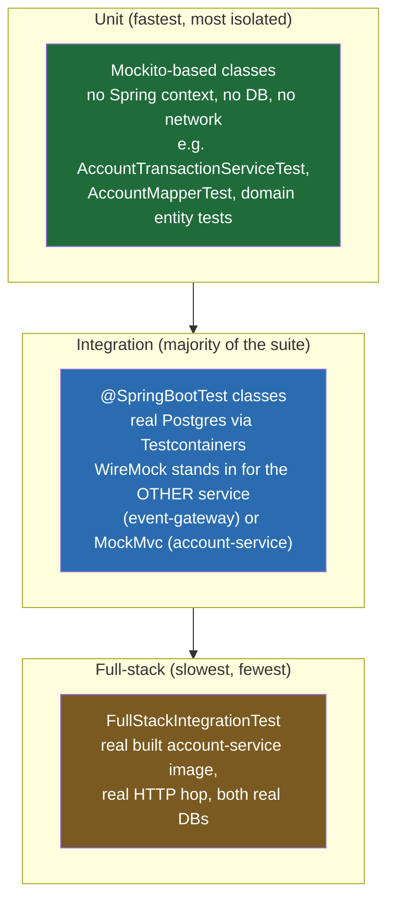
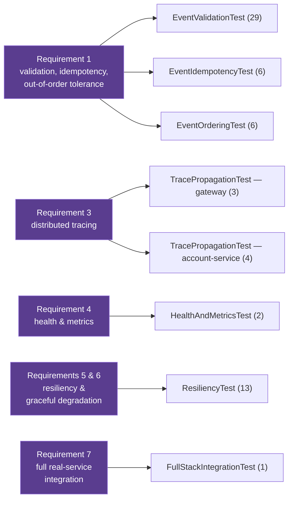
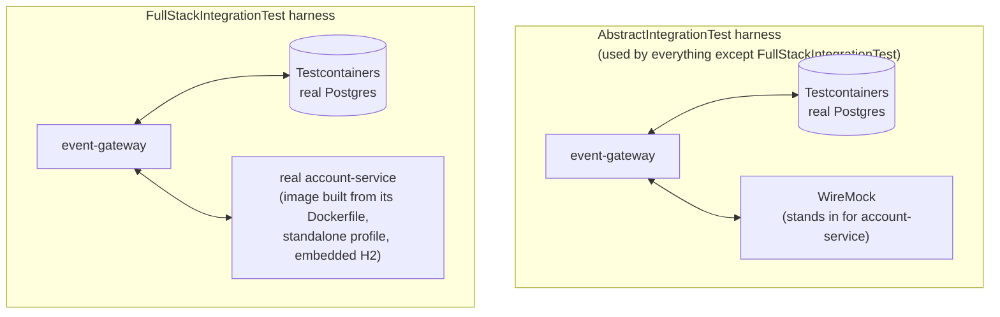

# Test Coverage — Event Ledger

How `event-gateway` and `account-service` are tested: what runs where, what each class actually
proves, and how it maps back to the stated requirements. Same conventions as `WIKI.md` — Mermaid
diagrams, grounded in the real test files rather than a generic description.

All counts below are from a fresh, full run of both suites (`./gradlew test`, rerun from clean):
**67 tests in event-gateway, 83 in account-service, 150 total, 0 failures, 0 skipped.** (event-gateway
was 60 before the outbox sweeper's 7 tests were added — see §5.)

## Table of contents

1. [How to run](#1-how-to-run)
2. [Test pyramid — what runs at each layer](#2-test-pyramid--what-runs-at-each-layer)
3. [Requirement → test class mapping](#3-requirement--test-class-mapping)
4. [Two test harnesses, and why both exist](#4-two-test-harnesses-and-why-both-exist)
5. [event-gateway — per-class coverage](#5-event-gateway--per-class-coverage)
6. [account-service — per-class coverage](#6-account-service--per-class-coverage)
7. [Known gaps — what's deliberately not covered](#7-known-gaps--whats-deliberately-not-covered)

---

## 1. How to run

```bash
# each repo, independently
./gradlew test

# just one class while iterating
./gradlew test --tests "com.eventledger.gateway.ResiliencyTest"

# the one slow test (builds a real Docker image) — see WIKI.md §1/README for why
./gradlew test --tests "com.eventledger.gateway.FullStackIntegrationTest"
```

Docker must be running for both suites — every integration test uses Testcontainers for a real
Postgres (not H2), and `event-gateway`'s suite additionally uses WireMock to stand in for
`account-service` (except `FullStackIntegrationTest`, which uses neither stub — see §4).

---

## 2. Test pyramid — what runs at each layer



`event-gateway`'s suite is almost entirely integration-level by design (see `AbstractIntegrationTest`'s
own doc comment): the whole point of the idempotency guarantee is that it's enforced by a real
Postgres unique-constraint, not an application-level check, so testing against H2 would risk
proving the wrong thing. `account-service` has a thicker unit layer underneath its integration
tests (domain entities, mapper, metrics, and a mocked-writer version of the service logic).

---

## 3. Requirement → test class mapping

Every integration test class in `event-gateway` carries a `@DisplayName("Requirement N: ...")` —
this is the actual, literal mapping from the code, not an inferred one.



`account-service` doesn't number its tests by requirement the same way (it's the callee, not the
public-facing contract the requirements doc is framed around), except for its own
`TracePropagationTest` — the callee-side half of Requirement 3, proving it *honors* the
`traceparent` header `event-gateway` sends rather than just proving the sender sends it.

---

## 4. Two test harnesses, and why both exist



WireMock lets a test force account-service into an exact failure mode on demand — timeout, 5xx,
connection refused, slow response — which is precisely what proving the circuit breaker/retry
behavior requires, and is awkward to do reliably against a real, healthy service. That's the
right tool for `ResiliencyTest`, `EventIdempotencyTest`, etc.

But it means none of those tests actually prove the two *real* codebases agree on the wire
contract — a WireMock stub will happily return whatever a test tells it to, even a shape
`account-service` would never really send. `FullStackIntegrationTest` is the one test that
removes the stub entirely: it builds the real `account-service` Docker image from
`../account-service`'s own `Dockerfile`, runs it with its `standalone` profile (embedded H2, so
no second Postgres container is needed), and drives one request through the real hop — the
automated equivalent of the manual `docker-compose.full.yml` + curl walkthrough in the README.
It's deliberately not built on `AbstractIntegrationTest` (a `full-stack-test=true` marker property
forces it into its own, never-shared Spring test-context cache entry) so it can never accidentally
inherit the WireMock-wired context instead of standing up its own real one.

---

## 5. event-gateway — per-class coverage

| Class | Tests | What it proves |
|---|---|---|
| `EventValidationTest` | 29 | Every required field missing (parameterized across all 6 fields), blank-vs-missing distinction, `eventId` size boundary (128/129 chars), malformed/lower-case currency, non-numeric amount, zero/negative amount, unknown `type`, lower-case `type`, explicit JSON `null`, malformed timestamp, optional `metadata`, non-JSON body, unsupported Content-Type (415), unsupported HTTP method (405), the full `ErrorResponse` shape, and that a rejected event never reaches account-service. |
| `EventIdempotencyTest` | 6 | First submission `201` / resubmit `200`; a duplicate returns the **original** stored event, not the resubmitted payload; a duplicate does not re-call account-service; concurrent identical submissions (8 threads) produce exactly one `201`; a `FAILED` event is re-driven (not silently swallowed) on resubmit; `eventId` reused under a **different** `accountId` returns the original account's event (documents that `eventId` is a global, not per-account, key). |
| `EventOrderingTest` | 6 | Listing is chronological by `eventTimestamp` regardless of arrival order; scoped correctly per account; identical timestamps break ties deterministically by `eventId`; unknown account returns `[]` not `404`; a DEBIT arriving before its earlier CREDIT still lists correctly and nets to the right balance (verified via the forwarded downstream payload, since this service holds no balance itself); straightforward net-balance = sum(CREDIT) − sum(DEBIT) check. |
| `ResiliencyTest` | 13 | Downstream failure → `503` not `500`/hang; event durably stored `FAILED` on downstream failure; circuit breaker opens after repeated failures and then fails fast (asserted on `CircuitBreakerRegistry` state, not just HTTP codes); a slow downstream is timed out, not hung; retry actually re-attempts before failing; a 4xx from downstream is `502` and does **not** trip the breaker; reads (`GET /events/{id}`, `GET /events?account=`) keep working during an outage; Gateway's own health stays `UP` when only the downstream is down; balance-query proxy: `503` when unreachable, `200` when healthy, `404` when the account genuinely doesn't exist (not laundered into `503`), and a slow balance query is timed out. |
| `TracePropagationTest` | 3 | A W3C `traceparent` header is generated and forwarded on the outbound call to account-service; the same trace id shows up in event-gateway's own response header/logs. |
| `HealthAndMetricsTest` | 2 | `/health` (or `/actuator/health`) reports its dependencies; custom business metrics (applied/duplicate/rejected counters) are exposed on the metrics endpoint. |
| `FullStackIntegrationTest` | 1 | The full real-to-real flow: `POST /events` against the real built account-service image, then `GET /accounts/{id}` (through the Gateway's own proxy, not hitting account-service directly) confirms the balance actually landed — see §4. |
| `OutboxSweeperTest` | 6 | Beyond-spec: the `@Scheduled` outbox sweeper's business logic, calling `sweep()` directly (not the real timer) for determinism. A `FAILED` event is redriven to `APPLIED`; a still-failing downstream leaves it `FAILED` with `redriveCount` incremented; an orphaned stale `PENDING` row is reaped to `FAILED` and redriven in the same sweep; a fresh (non-stale) `PENDING` row is left untouched (might be a live request in flight); a chronically-failing event stops being picked up once `redriveCount` exceeds `max-redrive-attempts`; one poison-pill event doesn't stop the rest of a batch from being redriven. Runs in its own `@DirtiesContext`-guarded Spring context — see class Javadoc for why that annotation is load-bearing, not decorative. |
| `OutboxSweeperSchedulingTest` | 1 | Beyond-spec: proves `interval-ms` genuinely drives the real Spring `@Scheduled` trigger (not just a config value nobody reads) — overrides it to 200ms, never calls `sweep()` directly, and asserts a seeded `FAILED` event is redriven on its own within a 5s bound. Also `@DirtiesContext`-guarded. |

## 6. account-service — per-class coverage

| Class | Tests | What it proves |
|---|---|---|
| `AccountControllerIT` | 19 | Full HTTP surface via MockMvc: new transaction `201`, duplicate `200`, balance read, unknown-account `404`, chronological transaction listing, insufficient-funds `409`, currency-mismatch `400`, negative/zero amount `400`, blank `eventId` `400`, invalid `type` `400` (names allowed values), malformed JSON `400`, invalid currency code `400`, every required field missing (parameterized), a tampered duplicate resubmit returns the **original** transaction with the balance unaffected, and the `eventId`-reused-for-a-different-account case → `409` with the second account genuinely never created. |
| `AccountTransactionServiceTest` | 10 | Mocked-writer unit tests: applies a new transaction; upfront duplicate returns existing without re-applying; concurrent-race duplicate reads back the winner; the "winner row not readable" edge case throws `IllegalStateException`; account-creation race is tolerated; unknown account throws; listing delegates to the writer; **and** the `eventId`/different-account mismatch is rejected on both the upfront-duplicate path and the concurrent-race path specifically. |
| `AccountTransactionWriterIT` | 14 | The real balance arithmetic against a real Postgres: CREDIT increases balance, DEBIT decreases it, a DEBIT exactly equal to the balance succeeds and lands at zero (the boundary), a mixed sequence of CREDITs/DEBITs nets correctly, balance is correct regardless of arrival order relative to `eventTimestamp`, a DEBIT arriving *before* its funding CREDIT is still rejected (a documented, pinned-down limitation — arrival order governs the live balance check, not `eventTimestamp`), insufficient funds is rejected and leaves the balance unchanged, currency mismatch is rejected and leaves the balance unchanged, listing is ordered by `eventTimestamp` not arrival order, duplicate `eventId` insert violates the PK constraint, applying against a nonexistent account throws, and concurrent applies on the same account are correctly serialized by the row lock (5 threads, exact expected sum). |
| `AccountTransactionServiceIT` | 7 | Same service, real Spring context + real Postgres (vs. the mocked unit version above): account created lazily on first transaction, resubmit returns the original as a duplicate, insufficient funds rejected, currency mismatch rejected, unknown account throws, chronological listing, and a 5-thread concurrent resubmit race produces exactly one non-duplicate outcome. |
| `GlobalExceptionHandlerTest` | 9 | Every `@ExceptionHandler` method tested directly (unit-level, mocked `Tracer`/`AccountMetrics`): validation failures, constraint violations, unreadable body with a bad enum value, generic unreadable body, account-not-found, insufficient funds, currency mismatch, unexpected exceptions → `500`, and that `traceId` is omitted when no span is active. |
| `TracePropagationTest` | 4 | The callee-side half of Requirement 3: an inbound `traceparent` header is continued (not replaced with a fresh trace) — both in the response header and in the error body's `traceId` — and a request with no inbound header still mints its own trace. This is the test that caught the missing `management.tracing.propagation.type: W3C` config (see `WIKI.md` §1). |
| `HealthControllerIT` | 1 | `/health` reports `UP` with the database check passing. |
| `AccountRepositoryIT` | 4 | Save/find by id; `findByIdForUpdate` actually locks and returns the row; returns empty for an unknown account; duplicate `account_id` insert violates the PK constraint. |
| `TransactionRepositoryIT` | 2 | Ordering by `event_timestamp` then `event_id` as tiebreaker; empty list for an account with no transactions. |
| `AccountTest` / `TransactionTest` | 3 / 2 | Plain domain-entity unit tests: `Account` starts at zero balance with matching timestamps, `isNew()`/`markNotNew()` JPA lifecycle behavior, balance/updatedAt mutability; `Transaction`'s constructor populates every field, same JPA `isNew()` lifecycle check. |
| `AccountMapperTest` | 2 | Entity → response DTO mapping for both `Transaction` and `Account`. |
| `AccountMetricsTest` | 3 | Applied-by-type counters, duplicate counter, and rejection counters by reason (used as example data here, not a test of any specific business rule). |
| `TraceIdResponseFilterTest` | 2 | `X-Trace-Id` response header is set when a span is active, and skipped when it isn't. |
| `AccountServiceApplicationTests` | 1 | Plain Spring Boot `contextLoads()` smoke test. |

---

## 7. Known gaps — what's deliberately not covered

- **No Pact / consumer-driven contract tests.** The wire contract between the two services is
  proven by `FullStackIntegrationTest` (real code both sides) and documented via the OpenAPI spec
  generated from `account-service`'s own controller annotations — but nothing would fail
  automatically if one side's DTO shape silently drifted from the other's without a shared spec
  gate. See `WIKI.md`'s gaps discussion.
- **No load/soak/chaos testing** of the circuit breaker under sustained concurrent traffic —
  `ResiliencyTest`'s concurrency tests use small, fixed thread counts (5–8) to prove correctness
  of the locking/dedup logic, not to characterize behavior under production-scale load.
  Explicitly out of scope per this being "a take-home, not a system under production load" (the
  same rationale the code itself gives for sampling 100% of traces).
- **`OutboxSweeper` has no test for two concurrent sweeper instances racing on the same row.**
  The CAS it shares with the client-resubmit path (`compareAndSetStatusForRedrive`) is the same
  primitive already proven safe under concurrency elsewhere in the suite (e.g.
  `EventIdempotencyTest`'s 8-thread race), so this isn't an untested *mechanism* — but there's no
  test that literally runs two `OutboxSweeper` instances (i.e. two Gateway replicas) against the
  same row simultaneously. Only relevant if the Gateway is ever scaled to more than one instance;
  see the multi-instance note in the sweeper's design discussion.
  