# Event Ledger — System Wiki

Two independent Spring Boot services — `event-gateway` (this repo) and `account-service`
(sibling repo) — each with its own Postgres database, talking over plain HTTP. This document
covers the full system: architecture, schemas, APIs, one diagram per end-to-end use case, and a
deep-dive into how the Resilience4j retry + circuit breaker stack actually behaves.

All diagrams are [Mermaid](https://mermaid.js.org/) — they render natively on GitHub/GitLab and
most markdown viewers.

## Table of contents

1. [System architecture](#1-system-architecture)
2. [Database schemas](#2-database-schemas)
3. [API reference](#3-api-reference)
4. [End-to-end flows](#4-end-to-end-flows)
   - [4.1 Submit a new event (happy path)](#41-submit-a-new-event-happy-path)
   - [4.2 Duplicate resubmission (idempotent)](#42-duplicate-resubmission-idempotent)
   - [4.3 Downstream failure, then recovery](#43-downstream-failure-then-recovery)
   - [4.4 Reads survive an Account Service outage](#44-reads-survive-an-account-service-outage)
   - [4.5 Balance query proxy — three outcomes](#45-balance-query-proxy--three-outcomes)
   - [4.6 eventId reused across a different account](#46-eventid-reused-across-a-different-account)
5. [Resilience4j deep-dive: retry + circuit breaker](#5-resilience4j-deep-dive-retry--circuit-breaker)
6. [Future enhancement: async fallback via outbox + Kafka](#6-future-enhancement-async-fallback-via-outbox--kafka)

---

## 1. System architecture

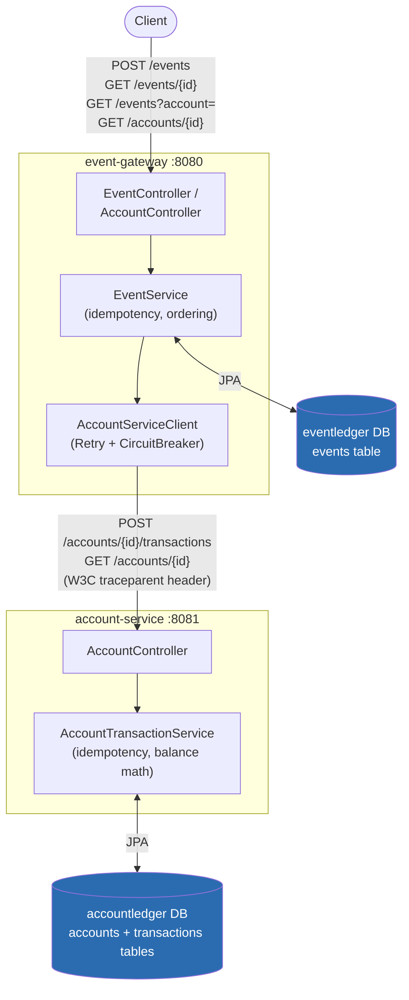

Key properties, enforced by design rather than convention:

- **No shared database, no shared in-process state.** `event-gateway` never opens a connection to
  `accountledger`, and vice versa — confirmed by grepping each repo for the other's DB host/port;
  there are zero references. The only thing crossing the process boundary is the HTTP call above.
- **Idempotent at both hops**, keyed by the same client-supplied `eventId` — see [4.2](#42-duplicate-resubmission-idempotent).
- **Trace propagation**: `event-gateway` generates/forwards a W3C `traceparent` header;
  `account-service` continues that trace rather than minting a new one, so one `traceId` ties a
  single client request to log lines in both services.

---

## 2. Database schemas

### `eventledger` (event-gateway's own DB)

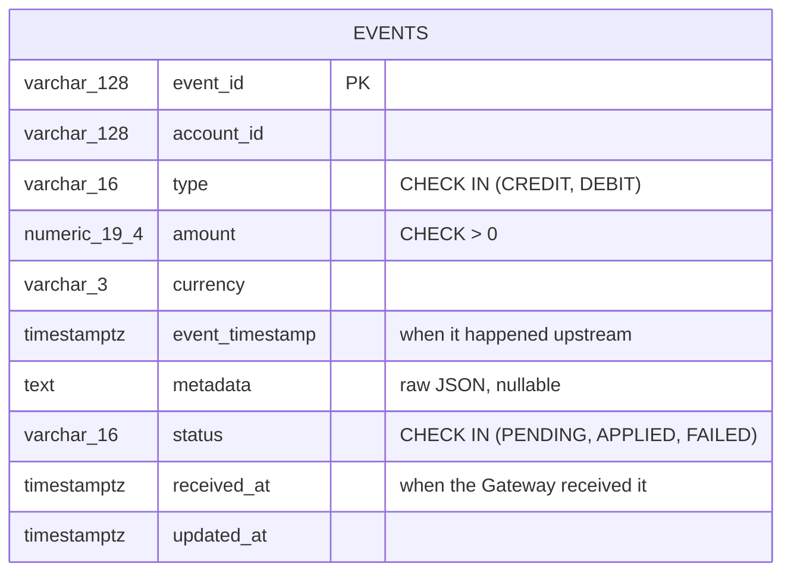

- `pk_events` on `event_id` — this **is** the idempotency guarantee. Not an application check: a
  concurrent duplicate submission is only ever resolved atomically by the database rejecting the
  second insert.
- `idx_events_account_timestamp (account_id, event_timestamp, event_id)` — serves
  `GET /events?account=`, which must return chronological order by `event_timestamp`, with
  `event_id` as a deterministic tiebreaker for identical timestamps.
- `idx_events_status` — reserved for a not-yet-built outbox sweeper that would poll
  `PENDING`/`FAILED` rows (see [§5](#5-resilience4j-deep-dive-retry--circuit-breaker) note at the end).

### `accountledger` (account-service's own DB)

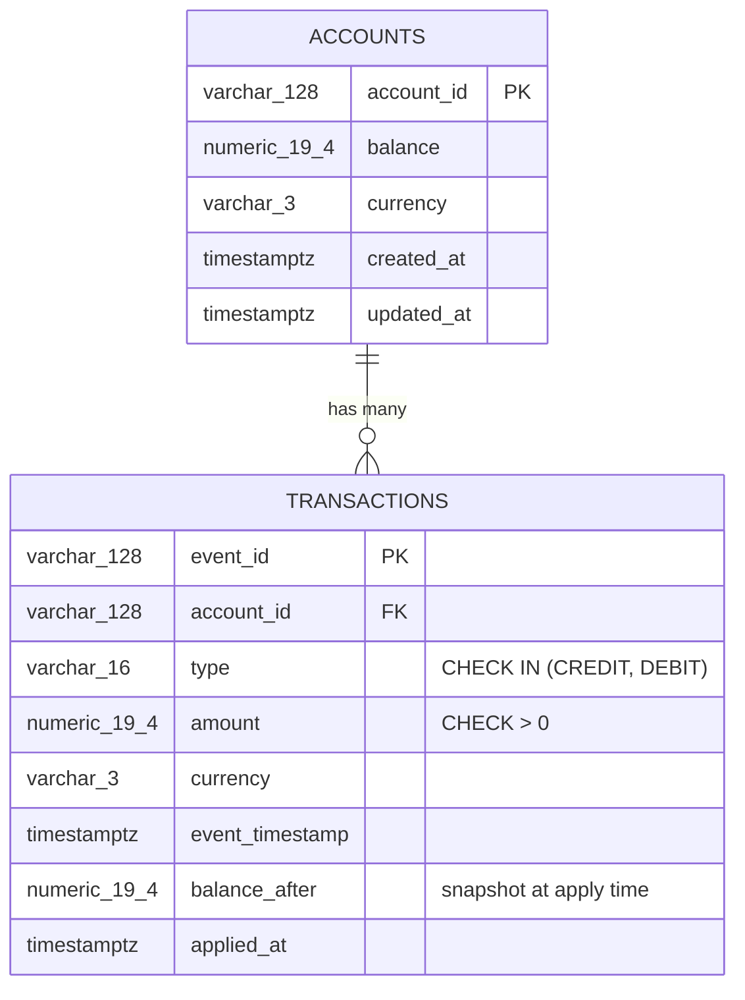

- `pk_transactions` on `event_id` mirrors `events.event_id` — the same idempotency pattern,
  independently enforced on this side of the hop.
- `fk_transactions_account` — an account is created lazily on its first transaction; there's no
  separate "create account" endpoint.
- `idx_transactions_account_timestamp` — same chronological-listing purpose as the Gateway's index.
- **Net balance = sum(CREDIT amounts) − sum(DEBIT amounts)**, maintained incrementally in
  `accounts.balance` rather than recomputed from `transactions` on every read.

---

## 3. API reference

### event-gateway (`:8080`)

| Method | Path | Request body | Success | Failure modes |
|---|---|---|---|---|
| `POST` | `/events` | `EventRequest` (`eventId, accountId, type, amount, currency, eventTimestamp, metadata?`) | `201` new / `200` duplicate → `EventResponse` | `400` validation, `503` Account Service unreachable, `502` Account Service rejected |
| `GET` | `/events/{id}` | — | `200` → `EventResponse` | `404` unknown id |
| `GET` | `/events?account={id}` | — | `200` → `EventResponse[]`, chronological | `400` missing `account` param |
| `GET` | `/accounts/{accountId}` | — | `200` → `AccountBalance` (proxied) | `404` no such account, `503` Account Service unreachable |

### account-service (`:8081`)

| Method | Path | Request body | Success | Failure modes |
|---|---|---|---|---|
| `POST` | `/accounts/{accountId}/transactions` | `TransactionRequest` (`eventId, type, amount, currency, eventTimestamp`) | `201` new / `200` duplicate → `TransactionResponse` | `400` validation/currency mismatch, `409` insufficient funds *or* eventId reused for a different account |
| `GET` | `/accounts/{accountId}` | — | `200` → `AccountResponse` | `404` unknown account |
| `GET` | `/accounts/{accountId}/transactions` | — | `200` → `TransactionResponse[]`, chronological | — |

Both services additionally expose `GET /actuator/health` (or `/health`), `/actuator/prometheus`,
and account-service exposes a generated OpenAPI contract at `/v3/api-docs` /
`/swagger-ui/index.html`.

---

## 4. End-to-end flows

### 4.1 Submit a new event (happy path)

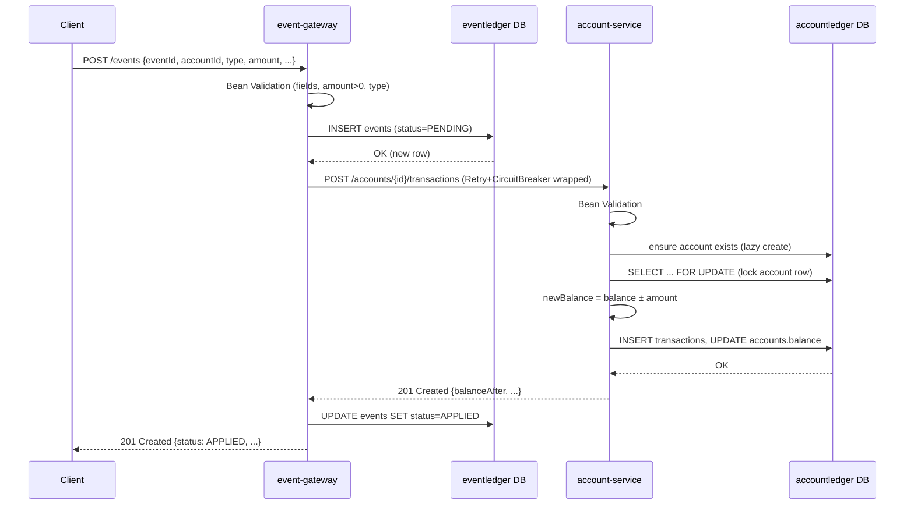

### 4.2 Duplicate resubmission (idempotent)

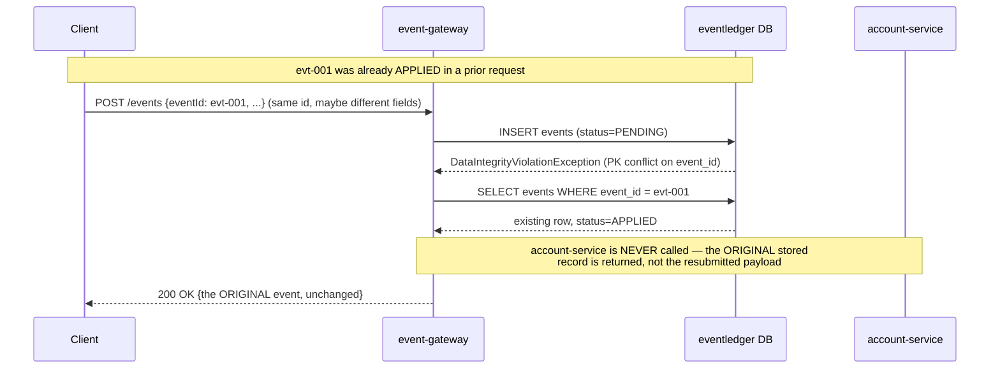

Both services enforce this the same way — a primary-key violation on `event_id`, not a
check-then-insert — because that's the only thing that's atomic under concurrent duplicates
(proven by dedicated concurrency tests: N threads racing the same `eventId` produce exactly one
`201` and N-1 `200`s).

### 4.3 Downstream failure, then recovery

```mermaid
sequenceDiagram
    participant C as Client
    participant GW as event-gateway
    participant GWDB as eventledger DB
    participant AS as account-service

    rect rgb(60, 20, 20)
    Note over C,AS: Request 1 — Account Service is down
    C->>GW: POST /events {eventId: evt-X, ...}
    GW->>GWDB: INSERT events (status=PENDING)
    GW->>AS: POST /accounts/.../transactions
    AS--xGW: connection refused / timeout / 5xx
    Note over GW: Retry (3 attempts, exp. backoff+jitter) all fail,<br/>or the circuit breaker is already OPEN
    GW->>GWDB: UPDATE events SET status=FAILED
    GW-->>C: 503 Service Unavailable<br/>"stored, safe to resubmit with the same eventId"
    end

    rect rgb(20, 60, 20)
    Note over C,AS: Request 2 — Account Service has recovered, client resubmits
    C->>GW: POST /events {eventId: evt-X, ...} (identical eventId)
    GW->>GWDB: INSERT fails (PK conflict) → read existing row, status=FAILED
    GW->>GWDB: compareAndSetStatus(FAILED → PENDING) — wins the re-drive race
    GW->>AS: POST /accounts/.../transactions (re-driven)
    AS-->>GW: 201 Created
    GW->>GWDB: UPDATE events SET status=APPLIED
    GW-->>C: 200 OK {status: APPLIED}
    end
```

The event is durably stored as `PENDING` **before** the downstream call — the client-visible
response is never a lie about whether the event was recorded. `compareAndSetStatus` is what
makes it safe for two concurrent resubmits of the same failed event to race: only one wins the
transition and re-drives the call.

### 4.4 Reads survive an Account Service outage

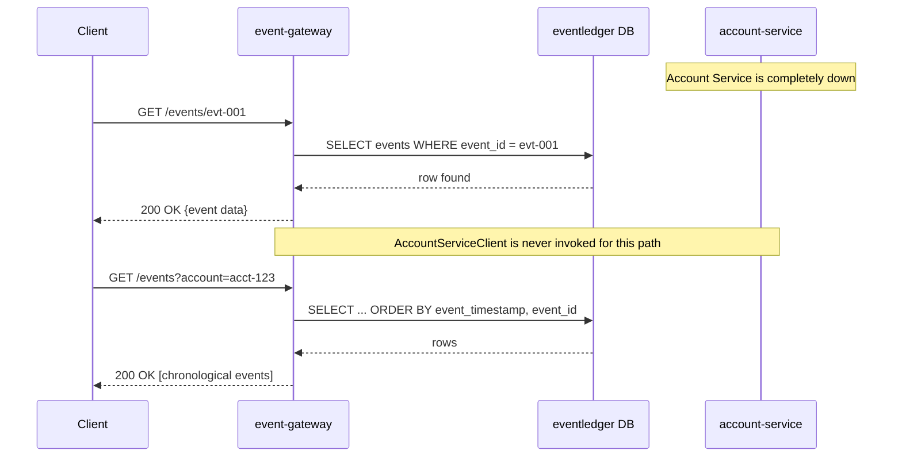

`EventService.get()` and `.listByAccount()` never touch `AccountServiceClient` — this is a
property of the code, not a fallback: there is no downstream call in this path to fail in the
first place.

### 4.5 Balance query proxy — three outcomes

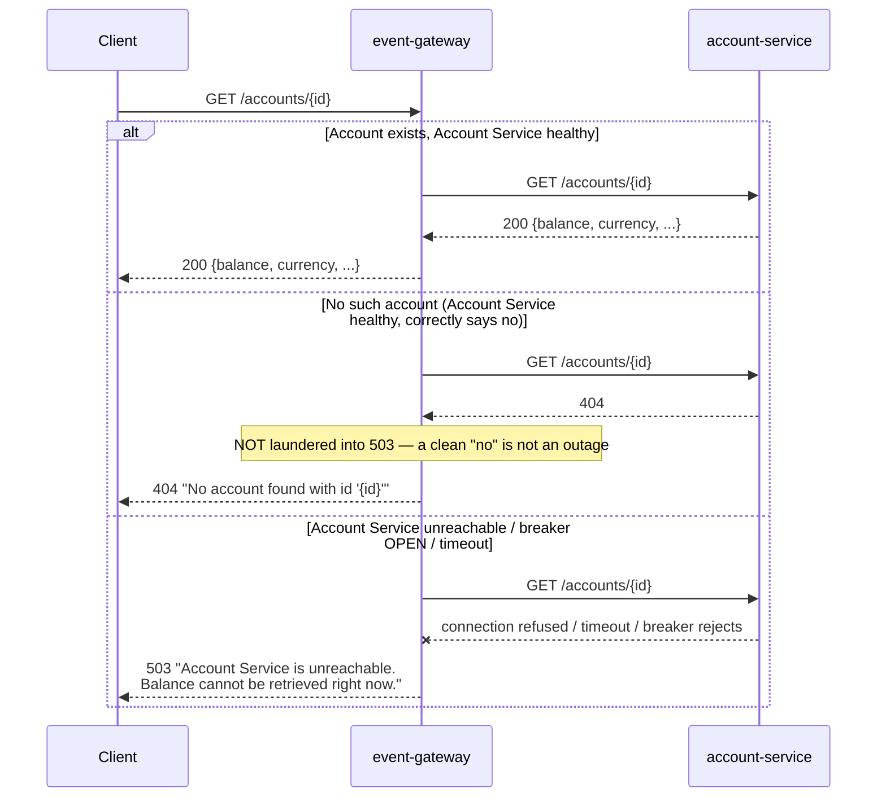

This endpoint reuses the exact same `AccountServiceClient` circuit breaker + retry + timeout
instance as the write path — no separate resiliency config needed, since it's the same
downstream dependency being protected against.

### 4.6 eventId reused across a different account

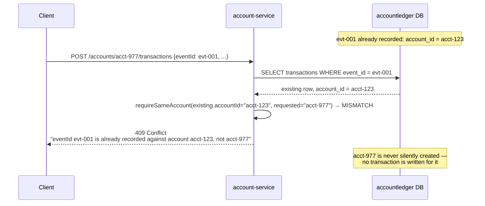

Before this guard existed, a duplicate `eventId` submitted for a *different* account was
silently treated as "just a duplicate" — returning `acct-123`'s transaction with a plain `200`,
while never creating anything for `acct-977`. `event-gateway` would then see that `200` as
success and mark its own `acct-977` event `APPLIED`, even though nothing was ever recorded for
that account downstream. `requireSameAccount()` closes that gap by comparing the existing row's
`account_id` against the one just requested before treating anything as a harmless duplicate.

---

## 5. Resilience4j deep-dive: retry + circuit breaker

### Aspect order

Resilience4j's Spring Boot integration wraps annotations outside-in in a fixed order. On
`AccountServiceClient`, both `applyTransaction()` and `getBalance()` are annotated:

```java
@Retry(name = "accountService", fallbackMethod = "...Fallback")
@CircuitBreaker(name = "accountService")
public ... someCall(...) { /* actual HTTP call via RestClient */ }
```

which composes as:

```
Retry( CircuitBreaker( actual HTTP call ) )
```

**Retry is outermost.** This matters: if the circuit breaker is `OPEN`, it throws
`CallNotPermittedException` *before* the HTTP call is attempted — and that exception type is on
Retry's `ignore-exceptions` list (`application.yml`), so Retry does **not** waste 3 attempts on a
call the breaker already refused. That's what "fail fast" actually means here.

### One call's decision tree

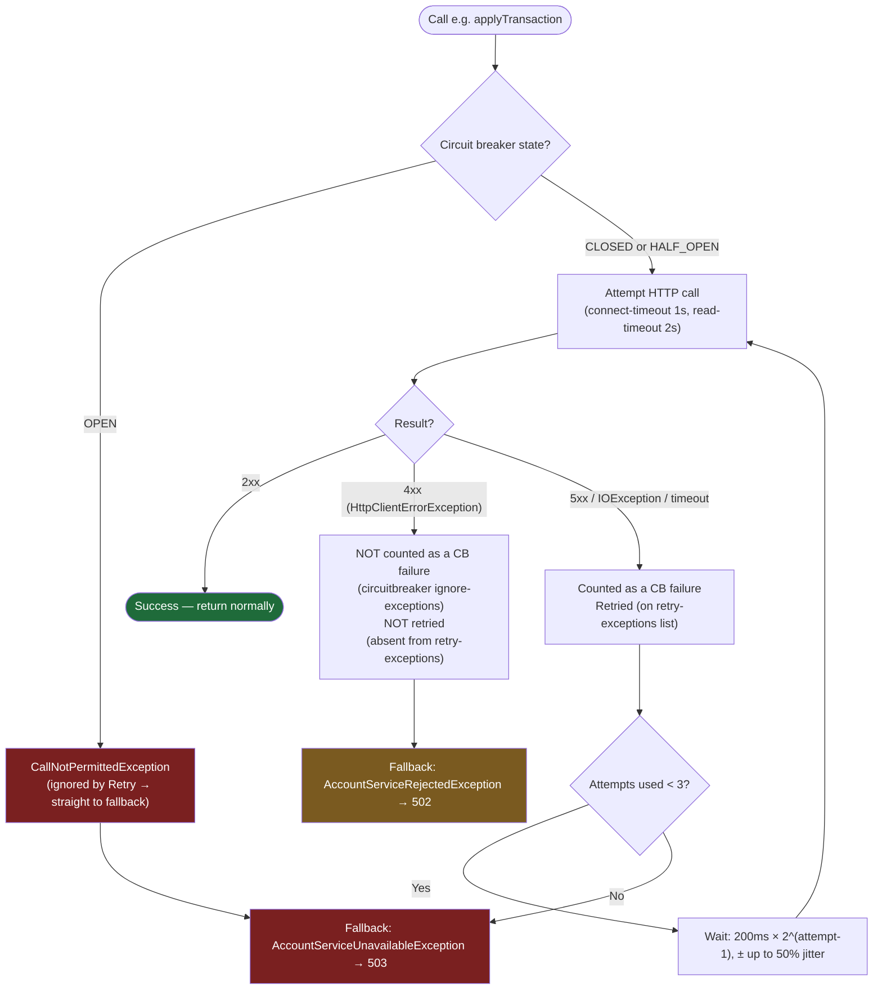

A 4xx is deliberately treated as "the downstream is healthy and we sent something it correctly
refused" — it must not count toward opening the circuit (a bad client payload shouldn't deny
service to every *other* caller), and must not be retried (retrying the same bad request 3 times
changes nothing).

### Retry timing, concretely

Config: `max-attempts: 3`, `wait-duration: 200ms`, `exponential-backoff-multiplier: 2`,
`randomized-wait-factor: 0.5`.

| Attempt | When | Base delay before it | Actual delay (± 50% jitter) |
|---|---|---|---|
| 1 | t = 0 | — | — |
| 2 (if #1 failed) | after backoff | 200ms | 100ms – 300ms |
| 3 (if #2 failed) | after backoff | 400ms (200 × 2¹) | 200ms – 600ms |
| *(give up)* | if #3 also fails | — | fallback fires |

Jitter exists so that many concurrent gateway threads retrying the same brief outage don't all
retry in lockstep and re-stampede a downstream service that's in the middle of recovering.

### Circuit breaker state machine

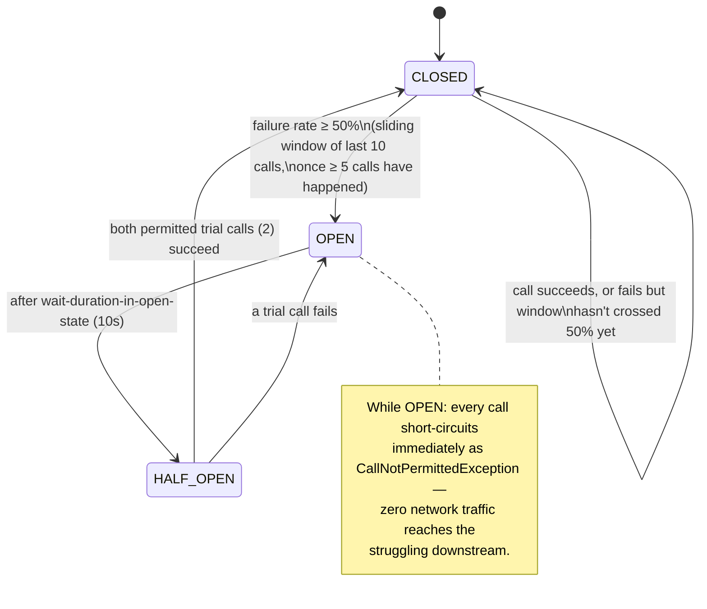

### Full worked example — a burst of failures across multiple requests

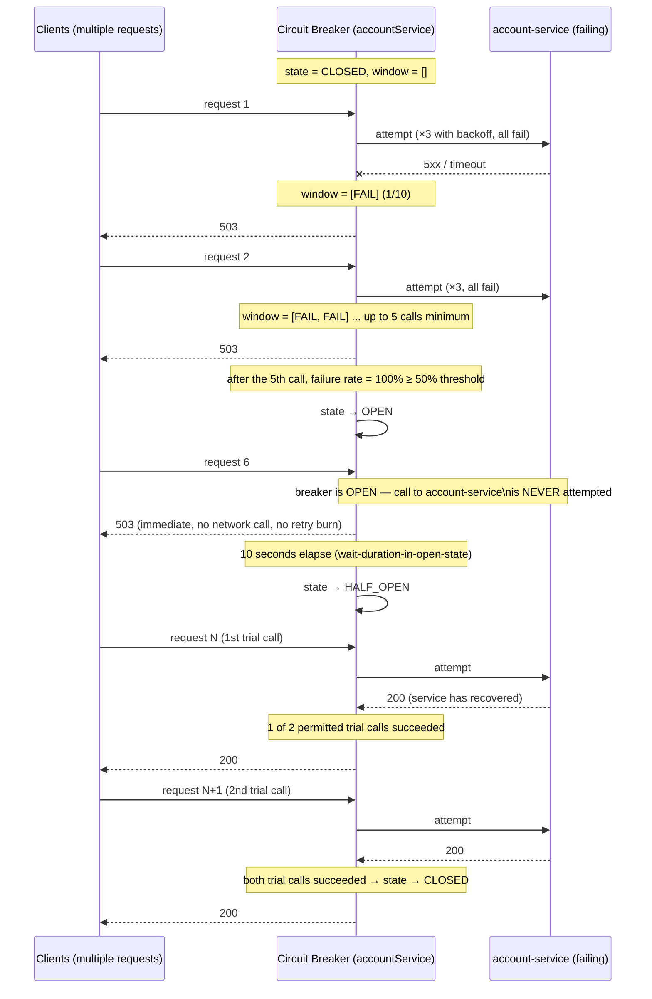

This whole sequence — CLOSED → OPEN → fail-fast → HALF_OPEN → CLOSED — is exercised directly by
`ResiliencyTest.circuitOpensAndThenFailsFast()` and the surrounding tests, which assert on the
breaker's actual state via `CircuitBreakerRegistry`, not just on HTTP status codes.

### What's *not* handled (see also: gaps audit)

The write path is durable across a downstream outage — `PENDING`/`FAILED` events sit in
`eventledger` — but recovery today is **client-initiated only** (a resubmit with the same
`eventId`). There is no automatic background sweeper polling `FAILED` rows and re-driving them;
`idx_events_status` and the `EventStatus` enum's own doc comment exist specifically so that
"bonus" could be added later as one new scheduled class, without a schema change.

---

## 6. Future enhancement: async fallback via outbox + Kafka

Two variants close the "no automatic re-drive" gap above, at increasing levels of decoupling.
The `events` table already functions as the outbox — `status IN (PENDING, FAILED)` is exactly
"needs (re)delivery," `APPLIED` is "delivered, done" — so neither variant needs a new table.

### Variant A — scheduler only, no new infrastructure

A `@Scheduled` poller reads `PENDING`/`FAILED` rows and re-drives each through the **same**
`AccountServiceClient` HTTP call that already exists today, reusing its retry/circuit-breaker
stack unchanged.

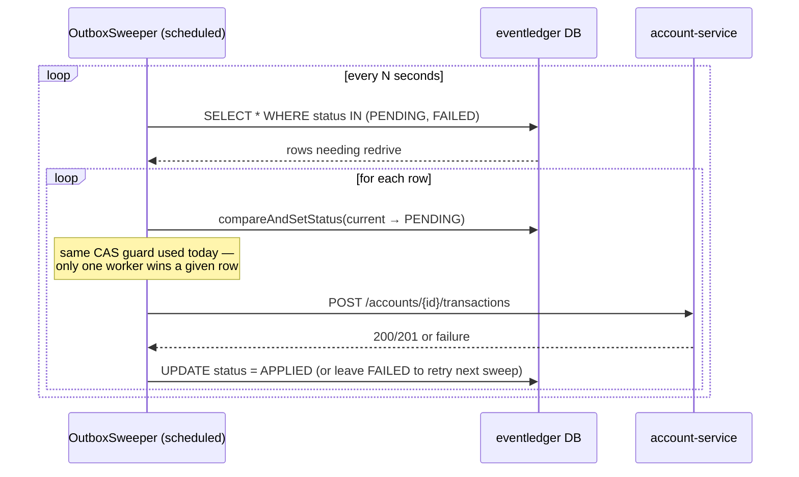

No new dependency, no new failure mode beyond what already exists — it's "a new class plus a
scheduled method," exactly as the code's own comment describes.

### Variant B — outbox + Kafka pub/sub + scheduler

The fuller Transactional Outbox pattern: instead of re-driving an HTTP call, a publisher
(scheduled poll, or CDC via Debezium reading the DB's WAL) pushes each `PENDING` row onto a
Kafka topic. `event-gateway` becomes a **producer**; `account-service` becomes a **consumer**,
applying the transaction asynchronously using the exact same `event_id` idempotency check it
already has today — just triggered by a message instead of a request. A second topic carries
the result back, since `event-gateway` still owns its own `events.status` and has no other way
to learn the outcome of something it no longer waits for synchronously.

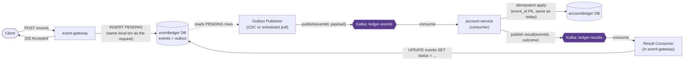

Full request lifecycle, including the client learning the eventual outcome:

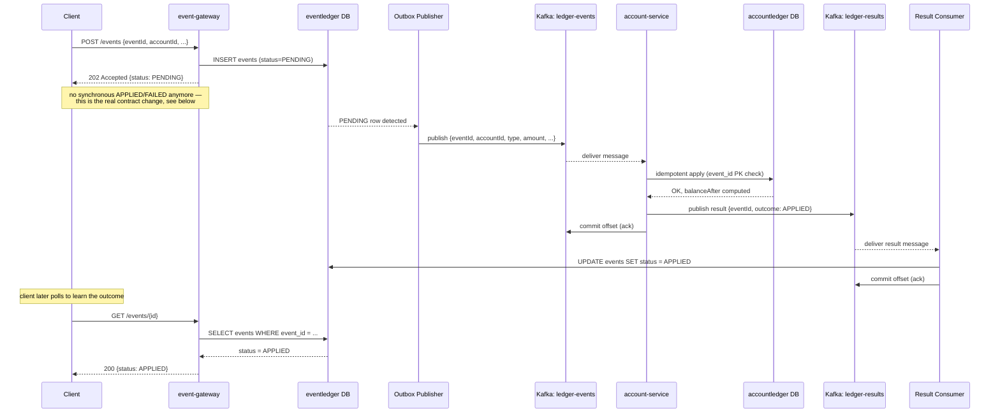

Why this is a genuinely stronger story for "Account Service unavailable" than Variant A: Kafka
durably retains unconsumed messages on `ledger-events` for its configured retention period while
`account-service` is down, and resumes exactly where it left off on restart — the queueing and
at-least-once delivery is Kafka's job, not hand-rolled retry/backoff logic. Combined with the
consumer's existing idempotent-by-`event_id` apply, at-least-once delivery becomes
effectively-once processing for free.

**The real tradeoff, stated plainly**: this is not a drop-in infrastructure swap. It changes the
synchronous API contract. Today, `POST /events` can confidently answer `APPLIED` or `FAILED` in
the same response, because the call to `account-service` is synchronous. Once publishing to
Kafka replaces that call, the Gateway only knows "accepted for processing" at request time — so
the honest response becomes `202 Accepted` with `status: PENDING`, and a client that wants the
final outcome has to poll `GET /events/{id}` afterward. That's not a regression, it's a more
honestly-async contract — but it's a real behavioral change for any caller relying on the current
synchronous `201/200` semantics, not just an internals detail.
